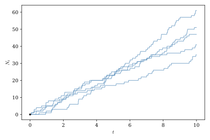
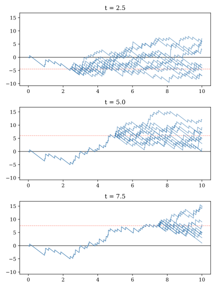

# Probability Spaces and Stochastic Processes {#sec-stochastic-processes}

This chapter begins by describing a sample space, a mathematical abstraction needed to define a stochastic process, the central object of analysis in continuous-time finance. We then turn to a discussion of how mathematicians describe information that it revealed gradually over time. By necessity, this chapter is considerably more dense with terminology than the rest of this book. We introduced this material now, primarily so that you will have the vocabulary needed to engage with the discussion of stochastic calculus that follows.

## Probability spaces

A **probability space** is the mathematical foundation that makes probability theory rigorous. A deep understanding of probability spaces grounded in measure theory is not essential for applied work in continuous-time finance, but some familiarity with them is helpful if for no other reason than that you will see them discussed in texts and papers and you should not be put off by them. A probability space consists of three components that work together: the sample space, the sigma-algebra, and the probability measure.

The **sample space**, usually denoted $\Omega$, is the set of all possible outcomes of a random experiment. If we are describing the single role of a die the sample space might be $\Omega = \{1, 2, 3, 4, 5, 6\}$. If we are describing the value of a stock one year in the future the sample space might be $\Omega = \mathbb{R}^+$, the set of all positive real numbers. The sample space contains the fundamental building blocks of outcomes we can use to construct events whose probabilities we are abel to measure.

The **sigma-algebra**, usually denoted $\mathcal{F}$, is a collection of subsets of $\Omega$ that we call **events**—these are the collections of outcomes to which we can meaningfully assign probabilities. The sigma-algebra $\mathcal{F}$ must satisfy three properties:

1.  It must contain the whole space; $\Omega \in \mathcal{F}$.
2.  It must be closed under complements; If $A \in \mathcal{F}$, then $A^c \in \mathcal{F}$.
3.  It must be closed under countable unions; If $A_1, A_2, A_3, \ldots \in \mathcal{F}$ then $\bigcup_{i=1}^{\infty} A_i \in \mathcal{F}$.

The first property simly allows us to state that the probability that something happens is one. The second property ensures that if we can measure the probability that event $A$ happens, then we can also measure the probability that $A$ does not happen. Adding the third property allows us to make statements about the probabilities of combinations of events, such as the probability that either event $A_1$ or $A_2$ happens.

At first glance, the sigma-algebra may seem unnecessary. Why can't we just assign probabilities to every possible subset of $\Omega$? For finite sample spaces, such as rolling a dice or flipping a coin, we actually can! If you're rolling a die, it's perfectly fine to assign probabilities to any collection of outcomes you want. But for infinite or continuous sample spaces, things break down. It turns out that if $\Omega$ is uncountably infinite (like all real numbers in an interval), we cannot consistently assign probabilities to every possible subset while maintaining the basic rules we want probability to follow. For example, consider choosing a random number uniformly from $[0,1]$. We'd like the probability of any single point to be zero (since there are infinitely many). But if every subset had a well-defined probability, we could construct weird, pathological sets that would violate the basic requirement that probabilities sum properly. So the sigma-algebra is the mathematical "fine print" that keeps everything logically consistent, especially when infinity is involved.

The **probability measure** is a function $P: \mathcal{F} \to [0,1]$ that assigns a probability to each event in the sigma-algebra. It must satisfy three properties:

1.  It must be non-negative; $P(A) \geq 0$ for all events $A \in \mathcal{F}$
2.  It must be normalized; $P(\Omega) = 1$.
3.  It must be countably additive; If $A_1, A_2, \ldots$ are pairwise disjoint events, then $$
    P\left(\bigcup_{i=1}^{\infty} A_i\right) = \sum_{i=1}^{\infty} P(A_i).
    $$

These properties work with the properties of the sigma algebra to ensure that our probability statements make sense. For example, they ensure that if $A_1$ and $A_2$ are two non-overlapping events then the probability of $A_1$ and $A_2$ is zero and the probability of $A_1$ or $A_2$ is the sum of the probabilities of the individual events.

Importantly, and perhaps surprisingly, a probability measure need not reflect the literal physical odds that an event will occur. All that is required is that the measure satisfy the conditions listed above. We'll see later that notional probability measures not directly related to physical odds play a central roll in asset pricing. Two probability measures $P$ and $P'$ are considered **equivalent probability measures** if they both assign positive probabilities to the same events, even if those probabilities differ in magnitude.

Taken together, the triple $(\Omega, \mathcal{F}, P)$ forms a probability space. In a nutshell, the sample space $\Omega$ tells you what *can* happen, the sigma-algebra $\mathcal{F}$ tells you what collections of outcomes you're allowed to ask about, and the probability measure $P$ tells you how likely those collections are to occur.

## Stochastic processes: random functions that evolve over time {#sec-processes}

Typically, in applied work, we find it more convenient to work with numerical quantities that depend on outcomes in $\Omega$, rather than those outcomes directly. A **random variable** is a function, $x:\Omega \rightarrow \R$, that maps elements of the sample space to the real line.[^01-stochastic_processes-1] The cumulative distribution functions we commonly interact with assign probabilities to ranges of outputs of random variables. In the background the probability space determines how these probabilities are determined.

[^01-stochastic_processes-1]: Formally, a random variable must be measurable, meaning that for every interval (or, more generally, every Borel subset) of the real line, the set of outcomes that map into that interval belongs to $\mathcal{F}$. This ensures that probabilities of events involving the random variable are well defined.

A **stochastic process** is a collection of random variables indexed by time. Formally, a stochastic process is a family

$$
\{X_t\}_{t \ge 0},
$$

where for each time $t$, the quantity

$$
X_t : \Omega \rightarrow \mathbb{R}
$$

is a random variable defined on a probability space $(\Omega,\mathcal{F},P)$. For a *fixed time* $t$, $X_t$ is a random variable. For a *fixed outcome* $\omega \in \Omega$, the function

$$
  t \mapsto X_t(\omega)
$$

is called a **sample path** or **realization** of the process.

In practice, you should think about a stochastic process as a random function that evolves over time. A deterministic function like $Y_t(\omega) = t^2$ can be viewed as a particularly uninteresting example of a stochastic process. It generates the same path no matter what value of $\omega$ you plug into it.

A Poisson process is an example of a stochastic process that describes the occurrence of random events through time. We'll put it to use later in this book to model jumps in asset prices.

::: {.callout-tip title="Poisson Process"}
A process $\{N_t\}_{t \ge 0}$ is called a **Poisson process** with intensity (arrival rate) $\eta > 0$[^01-stochastic_processes-2] if it satisfies the following properties:

1.  Initial Condition

    $$
    N_0 = 0.
    $$

2.  Independent Increments

    For any times

    $$
    0 \le t_0 < t_1 < \cdots < t_n,
    $$

    the increments

    $$
    N_{t_1}-N_{t_0}, \quad
    N_{t_2}-N_{t_1}, \quad
    \ldots, \quad
    N_{t_n}-N_{t_{n-1}}
    $$

    are independent random variables.

3. *Stationary Increments

    For any $0 \le s < t$, the increment depends only on the length of the interval:

    $$
    N_t - N_s
    \sim
    \operatorname{Poisson}\bigl(\lambda (t-s)\bigr).
    $$

    In particular,

    $$
    P(N_t-N_s = k)
    =
    \frac{(\eta (t-s))^k e^{-\eta (t-s)}}{k!},
    \qquad
    k=0,1,2,\ldots
    $$

4.  **Sample Paths**

    The sample paths are piecewise constant and increase by jumps of size one at random arrival times.
:::

[^01-stochastic_processes-2]: It is more common to use the Greek letter $\lambda$ to denote the arrival rate but this parameter is also widely used in finance to stand for risk premiums. To avoid confusion we use the less standard $\eta$ label instead.

As shown in @fig-poisson_paths, realizations of Poisson processes are step functions. You can think of a Poisson process as counting the number of events that have occurred by time $t$, so the sample paths only step up, never down.

{#fig-poisson_paths}

For every $t \ge 0$,

$$
N_t
\sim
\operatorname{Poisson}(\eta t),
$$

with

$$
E[N_t] = \eta\,t,
$$

and

$$
\operatorname{Var}(N_t) = \eta\,t.
$$

## Modeling information flow over time with filtrations and conditional expectations {#sec-filtrations}

Finance is largely about forecasting the future from the past or inferring the value of an asset today based on information about the likelihood of future events. When working with random processes that evolve over time, we need a mathematically rigorous way to describe how information is revealed gradually. This is where the notion of filtrations comes in.

A **filtration** is a sequence of sigma-algebras $\{\mathcal{F}_t\}_{t \geq 0}$ that satisfies:

$$\mathcal{F}_s \subseteq \mathcal{F}_t \subseteq \mathcal{F} \quad \text{whenever } s \leq t$$

In other words, the sigma-algebras are nested and grow over time.

Think of $\mathcal{F}_t$ as representing "all the information available up to time $t$." As time progresses you can't "forget" what you've already observed (the sets are nested), you accumulate more information (the sigma-algebras grow), and you never have more information than is theoretically possible (everything stays within $\mathcal{F}$ the sigma algebra of the underlying probability space). For example, suppose $\{S_t\}$ represents a stock price over time and $\mathcal{F}_t$ represents all information available from observing the stock up to time $t$. You can answer questions like "Was the stock above $\$100$ at time $t-1$?" using $\mathcal{F}_t$. But you cannot answer "Will the stock be above $\$100$ at time $t+1$?" using only $\mathcal{F}_t$

A **filtered probability space** $(\Omega, \mathcal{F}, \{\mathcal{F}_t\}, P)$ extends a probability space by adding a time-indexed family of sigma-algebras that model information flow. This framework is indispensable for ensuring mathematical rigor when working with time-dependent randomness, distinguishing between what is "known" from what is "unknown" at each point in time, and properly defining conditional expectations and prediction. Just as the sigma-algebra was the "fine print" for probability spaces, the filtration is the "fine print" for describing processes that evolve over time.

In many applications we are interested in making predictions when only partial information is available. For example, suppose we are observing a stochastic process through time. At time $t$, we know everything that has happened up to that point, but we do not know what will happen in the future. Our prediction of a future quantity should therefore be based only on the information currently available. This idea leads to the concept of a **conditional expectation**. If $\mathcal{F}_t$ denotes the filtration describing all information available at time (t), then

$$
\E_t[X] = \E[X \mid \mathcal{F}_t]
$$

denotes the expected value of the random variable $X$ given everything that is known at time $t$.

Intuitively, $\E_t[X]$ is our best prediction of the random variable $X$ using only the information contained in the filtration. Unlike the unconditional expectation $\E[X]$, which is simply a constant, the conditional expectation is a random variable that depends on the information available at time $t$. As new information arrives and the filtration grows, our prediction is updated accordingly.

A stochastic process $\{X_t\}_{t \geq 0}$ is called **adapted** to the filtration $\{\mathcal{F}_t\}$ if $X_t$ is measurable with respect to $\mathcal{F}_t$ for each $t$. That is, the value of $X_t$ is "knowable" given the information in $\mathcal{F}_t$, and you can determine $X_t$ from what you've observed up to time $t$. An adapted process has the property that

$$
\E_t[X_t] = X_t.
$$

Virtually all of the stochastic processes you are likely to encounter in applied continuous-time finance are adapted to a filtratation. They describe the evolution over time of observable phenomena like equity prices and interest rates that are known in the past but not in the future.

Consider the Poisson process, $\{N_t\}$, we introduced in @sec-processes. Suppose we wish to predict the number of events that will have occurred by a later time $T>t$. At time $t$, we already know that $N_t$ events have occurred. The only uncertainty comes from the future arrivals between $t$ and $T$. Because the increments of a Poisson process are independent,

$$
\E_t[N_T]
=
N_t + \lambda(T-t),
$$

where $\lambda(T-t)$ is the expected number of additional events that will occur during the remaining interval.

When working with processes like the Poisson process that generate sample paths with discontinuities it is sometimes necessary to distinguish between processes that are adapted and those that are "predictable". An adapted process is known from information available at time $t$. A **predictable** process can be known from information available up to, but not including, time $t$. Such a process is measurable with respect to $\lim_{s\to t-} \mathcal{F}_s$.[^01-stochastic_processes-3] This distinction is, admittedly, rather subtle. Predictable is a stronger condition than adapted. All processes that are predictable are also adapted, and all processes that generate continuous sample paths that are adapted are also predictable. However, some processes that generate discontinuous sample paths may be adapted but not predictable.

[^01-stochastic_processes-3]: For technical reasons this is a necessary but not a sufficient condition for a process to be predictable.

For example, at 2:00 P.M. eastern time on the last day of its regular meetings, the Federal Reserve's Federal Open Market Committee announces decisions about its policies related to the management of short-term interest rates. These announcements frequently cause bond yields to jump. If we model a bond's yield using a jump process, $\{X_t\}$, we will probably assume that it is adapted but not predictable. Market participants can observe the bond yield up to 2:00, but they do not know what it will be once the FOMC announcement is published. If $\{X_t\}$ is not predictable then market participants cannot react to the FOMC's announcement until after it has occurred.

## Martingales {#sec-martingales}

Conditional expectations allow us to make predictions about future random variables using only the information available at the present time. This leads naturally to an important class of stochastic processes known as martingales.

A stochastic process $\{X_t\}$ is called a **martingale** with respect to the filtration $\{\mathcal{F}_t\}$ if

$$
\E_t[X_T] = X_t,
\qquad
0 \le t \le T.
$$

In words, the expected future value of the process, conditional on all information available at time $t$, is simply its current value. A fundamental feature of martingales, which we will exploit ruthlessly in later chapters, is that they exhibit no expected future drift over time, since if $\{X_t\}$ is a martingale then for $T>t$

$$
\E_t[X_T-X_t] = \E_t[X_T] - X_t = X_t - X_t = 0.
$$

Martingales are often interpreted as representing a fair game. Imagine participating in a game of chance where $X_t$ denotes your wealth after round $t$. If the game is fair, then regardless of everything that has happened so far, your expected wealth after any future round is equal to your current wealth. Past outcomes may influence your prediction of future outcomes, but they do not create an opportunity for systematic gain or loss.

A Poisson process is not a martingale because the number of expected future arrivals at any point in time is always positive. This is clearly evident from the upward slope of the simulated Poisson process paths in @fig-poisson_paths. However, suppose we construct a new random process, called a **compensated Poisson process**, by subtracting off the expected number of arrivals. That is, if $\{N_t\}$ is Poisson process with arrival intensity parameter $\eta$, let

$$
M_t = N_t - \eta\,t.
$$

We can think of $\{M_t\}$ as describing a kind of gambling game in which the player receives a payoff each time an event occurs, but is required to pay an actuarially fair fee per unit time to participate. This is precisely the sort of fair game we discussed above, and $\{M_t\}$ is indeed a martingale. To see this, observe that

$$
\begin{align*}
\E_t[M_T] =& \E_t[N_T - \eta\,T] \\
=& \E_t[N_T - N_t + N_t - \eta\,T] \\
=& \E_t[N_T - N_t] + N_t-\eta\,T \\
=& \eta\,(T-t) + N_t-\eta\,T \\
=& N_t-\eta\,t \\
=& M_t.
\end{align*}
$$

Simulated paths for a compensated Poisson process conditional on information observed at three different points in time are shown in @fig-martingale_ex. Notice that these paths exhibit no clear trend, and final values for the paths are clustered around the level the process took at the time it was observed.

{#fig-martingale_ex}

Martingales play a central role continuous-time finance. One of the most important results developed later in this book is that, under an appropriate probability measure, the discounted prices of traded assets are martingales. This simple observation forms the foundation much of modern asset pricing.

## Taking stock and looking forward

Much of the material we've covered in this chapter might seem pretty abstract, so much so that at this point you may be wondering whether the word "practical" in the title of this book is really appropriate. Fear not! In this book each chapter is more applied that the one before it. We're now standing at the peak of abstraction, looking down a steady slope toward the applied financial models to come. In the next chapter we will introduce the single most important stochastic process in continuous-time finance, a process that forms the foundation of all of the applied models we can look forward to.