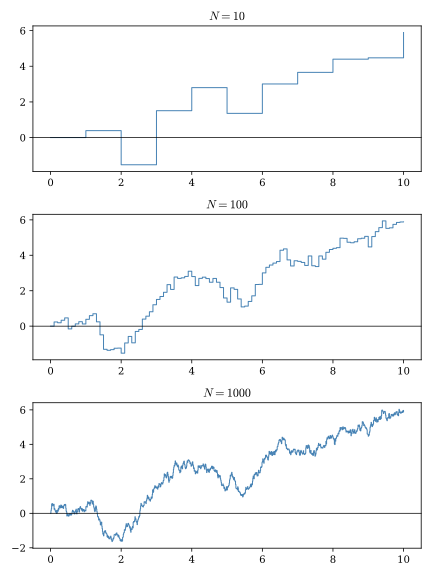
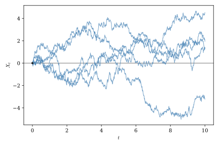
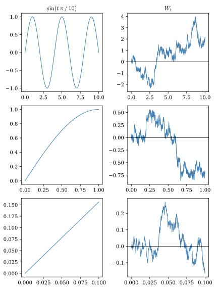

# Wiener Processes {#sec-wiener_prcoesses}

In this chapter we introduce the remarkable Wiener process, the most important stochastic process in continuous-time finance. We begin by showing how the Wiener process can be motivated as the continuous time analogue of normal random variables, which are ubiquitous in probability and statistics. We then give a formal definition for the Wiener process and enumerate some of its key properties. Finally we show how some of the process's unique features thwart attempts to analyze it using standard methods from calculus, necessitating the development of new methods discussed in the next chapter.

## From random walks to Wiener processes

Anyone with a passing exposure to probability and statistics will recognize the normal (a.k.a. Gaussian) distribution as the key distribution underpinning much of what we know about sequences of random events. It plays this role because of the Central Limit Theorem (CLT), which shows that the distribution of the average of a sequence of almost any independent and identically distributed (i.i.d.) random variables will converge to the normal distribution as the number of elements in the sequence becomes large. Happily, the normal distribution also has some very convenient mathematical properties, several of which are enumerated in the Appendix. Most notably, it is easy to prove that the sum of normal random variables is itself a normal random variable.

Given its importance in probability and statistics, it is natural to ask how we might construct an continuous-time analogue to the standard normal distribution. Suppose we wish to construct a random path from time $0$ to time $T$. We can do this by first subdividing the interval $[0,T]$\]into $n$ equally-sized increments of length $T/n$ so that $n_t = \left\lfloor t\,N\,/T\right\rfloor$ is the index of the largest time step smaller than $t$.[^02-wiener_processes-1] Now let

[^02-wiener_processes-1]: $\lfloor r \rfloor$ is the "floor" operator. It tells us the largest integer smaller than the real number $r$.

$$
S_t^n = \frac{1}{n_t}\sum_{i=1}^{n_t}X_i t,
$$

where and $X_1, X_2, ...$ are a sequence of i.i.d. random variables each with mean zero and variance one.

$S_t^n$ is called a **random walk**. For a given value of $t \leq T$, $S_t^n$ will generate random paths consisting of $\lfloor t/n \rfloor$ jumps evolving in discrete steps. @fig-wiener_limit shows how a single realization of a random walk might look as we increase the number of time steps.

{#fig-wiener_limit}

The gap from a discrete series of random steps to a continuous random process, as always, is bridged by taking a limit. Let

$$
W_t = \lim_{n\to\infty} S_t^n.
$$

$W_t$ generates continuous random paths over the interval $[0,T]$, as illustrated in @fig-wiener_paths.

{#fig-wiener_paths}

Notice that $W_t$ is defined as the limit of an average of $n_t$ random variables scaled by $t$. Given this, we can apply the CLT to obtain

$$
W_t \sim N(0,t).
$$

Confirming this result, @fig-wiener_dist compares a histogram of 10,000 simulated paths at $t=1$ with a standard normal probability density function.

{#fig-wiener_dist}

We can also use the CLT to characterize the distribution of increments of $W_t$. For any $s < t$ we have

$$
W_t - W_s = \lim_{N\to\infty} \frac{1}{n_t-n_s}\sum_{i = n_s}^{n_t} X_i (t-s),
$$

another limit of an average of random variables that is also normally distributed. Moreover, it should be clear from the definition of $W_t$ that any two non-overlapping increments of $W_t$ must be independent of one another since the $X_i$ variables used to construct those increments are themselves independent. These properties are sufficient to define the Wiener process.

::: {.callout-tip title="Wiener Process"}
A process $\left\{W_t\right\}_{t\geq 0}$ is called a **Wiener process** or a Brownian motion process if it satisfies the following properties:

1.  **Initial Condition**

    $$
    W_0 = 0
    $$

    almost surely.

2.  **Independent Increments**

    For any times

    $$
    0 \le t_0 < t_1 < \cdots < t_n,
    $$

    the increments

    $$
    W_{t_1}-W_{t_0}, \quad
    W_{t_2}-W_{t_1}, \quad
    \ldots, \quad
    W_{t_n}-W_{t_{n-1}}
    $$

    are independent random variables.

3.  **Stationary Gaussian Increments**

    For any $0 \le s < t$,

    $$
    W_t - W_s \sim N(0,\, t-s),
    $$

    meaning that the increment is normally distributed with mean zero and variance $t-s$.

4.  **Continuous Sample Paths**

    For almost every outcome $\omega \in \Omega$, the function

    $$
    t \mapsto W_t(\omega)
    $$

    is continuous in $t$.
:::

As we'll see throughout this book, Wiener processes are as ubiquitous in continuous-time settings as are normal random variables in static settings. It makes sense to think of them as continuous-time analogues to normal variables. We have seen that they are themselves normally distributed when evaluated at a particular point in time or across a time interval, and much of our intuition for working with normal random variables also applies to Wiener processes. However, as we discuss in the next section, Wiener processes are subtle mathematical beasts which must be treated with some care.

## What makes Wiener processes special?

While Wiener processes are continuous, they are not differentiable at any point. As one zooms in to a Wiener process path it does not begin to look like a straight line, as smooth functions do, but instead continues to look like a jagged coastline or mountain range (see @fig-wiener_frac).[^02-wiener_processes-2] To investigate the implications of this property, we will use Big-O notation, a convenient way of describing how the size of a quantity changes as a time increment becomes very small. This notation will also prove useful in the next chapter when we develop the tools of Itô calculus.

[^02-wiener_processes-2]: In fact, the Wiener process is an example of a fractal. It has a Hausdorff fractal dimension of 1.5, meaning that it occupies space on a two-dimensional plane somewhere between that of a one-dimensional line and a two-dimensional shape such as a square or a circle.

{#fig-wiener_frac}

Suppose $\Delta t > 0$ is a small time increment. We say that a function $f(\Delta t)$ is of order $O(g(\Delta t))$ as $\Delta t \rightarrow 0$ if there exists a constant $C$ such that

$$
|f(\Delta t)| \leq C |g(\Delta t)|
$$

for all sufficiently small values of $\Delta t$. Intuitively, this means that $f(\Delta t)$ grows or shrinks at approximately the same rate as $g(\Delta t)$, up to a constant multiple.

Throughout this book we will often use Big-O notation in a slightly informal way to describe the behavior of random variables. Strictly speaking, Big-O is defined for deterministic functions, but in probability it is common to use the same notation to describe the typical size of a random quantity. For example, if

$$
X \sim N(0,\sigma^2),
$$

then the standard deviation $\sigma$ provides a natural measure of the scale over which $X$ fluctuates. Approximately 68 percent of realizations lie within one standard deviation of the mean, and approximately 95 percent lie within two standard deviations, so it is reasonable to regard $\sigma$ as representing the characteristic magnitude of a typical realization. Consequently, when we write that $X$ is of order $O(\sigma)$ we simply mean that the random variable typically fluctuates on the scale of its standard deviation.

Applying this notation to Wiener processes increment, we have

$$
\Delta W_t = O(\sqrt{\Delta t})
$$

because Wiener increments have variance proportional to $\Delta t$ and hence standard deviation proportional to $\sqrt{\Delta t}$.

Recall that the in standard calculus the derivative is defined as the limit of the difference quotient,

$$
f'(t)
=
\lim_{\Delta t \to 0}
\frac{\Delta f(t)}{\Delta t}.
$$

If $f(t)$ is differentiable then the difference quotient converges to the fixed value $f'(t)$ so that

$$
\Delta f(t) = O(\Delta t).
$$

$O(\sqrt{\Delta t}) > O(\Delta t)$ for small values of $\Delta t$, meaning that $W_t$ fluctuates by more than is consistent with differentiability. Although a rigorous proof that $W_t$ is not differentiable requires more advanced probability theory, this simple scaling argument strongly suggests that Wiener sample paths are too irregular to possess ordinary derivatives. We can make this argument for any value of $t$, so $W_t$ is unlikely to be differentiable at any point in its domain.

This is the sense in which the Wiener process is special, and quite different from many other stochastic processes we are likely to encounter. It is continuous but nowhere differentiable. It's fractal character makes it too jagged to work with using traditional calculus methods. Fortunately, as we will soon see, Wiener processes are not totally intractable. We just need to apply some new rules when working with them.

## Foundations for a new type of calculus {#sec-convergence_concepts}

Derivatives and integrals, as you learned them, are built the same way no matter how complicated the function: chop the domain into small pieces, form a sum (or a difference quotient), and take a limit as the pieces shrink to zero. Nothing about this procedure requires that the function be deterministic — it works equally well for stochastic processes.

If we fix a single realization of a stochastic process, the path $X_t(\omega)$ is just an ordinary function of time, so the derivative $X_t'$ of a random process $X_t$ can be defined *pathwise*. $X_t'$ is itself a random process with the property that at time $t$ for almost every outcome $\omega$,

$$
\pd{X_t(\omega)}{t} = X_t'(\omega)
$$

That is, the derivatives of very nearly all of the paths of $X_t$ are equal to corresponding realizations of $X_t'$. Some pathological paths may arise in which the equality does not hold, but the odds that we will observe such a path is zero. We can use a similar pathwise approach to defining integrals involving random processes.

Pathwise constructions of derivatives and integrals for random processes rely on the notion of **almost sure convergence**. If $X_n$ is a sequence of random processes, we say that $X_n$ converges to the random process $X$ almost surely (a.s.) if

$$
\Prob\left[\lim_{n\to\infty}X_n=X\right] = 1.
$$

Pathwise calculus tools work when random paths do not vary too much over time, but this approach totally fails for Wiener processes. As we've seen, every individual Wiener process path is too jagged for an ordinary derivative to exist. Since the pathwise strategy needs the ordinary calculus limit to succeed path by path, and it never does, this strategy is a nonstarter. When working with Wiener processes, we need an alternative notion of what it means for a sequence of approximations to "converge" — one that doesn't require any single path to behave well, but still allows us to construct analogues to the traditional derivatives and integrals we are used to working with. **Mean square convergence** fits this bill perfectly.

We say that a sequence of random processes $X_n$ converges in mean square to the random process $X$ if

$$
\lim_{h\to 0} \E\left[(X_n-X)^2\right] = 0.
$$

Shorthand notation for mean squared convergence is $X_n \toms X$ or $\lim_{n\to\infty}X_n \eqasms X$.. A process that converges almost surely also converges in mean square, but the opposite is not true. Mean-square convergence permits individual paths to fluctuate no matter how large $n$ grows without ever settling to a particular value. Instead, it simply requires that the size of the discrepancy, averaged across all paths, diminishes quickly as $n\rightarrow\infty$. Because they demand less, definitions of objects like integrals based on mean-square convergence criteria can be applied to a broader range of stochastic processes, including wiener processes.

Individual Wiener paths are too irregular for ordinary calculus — they can’t be differentiated, and sums built along a single path don’t settle down to a limit. Mean-square convergence sidesteps this by changing what we ask for: instead of requiring convergence on each path separately, we only require that the mean squared discrepancy shrinks to zero. A quantity can fail to converge on any single path, and yet still converge in this aggregate, population-level sense. This allows us to build a rigorous integral against a process whose paths, examined one at a time, are too wild to integrate against at all.

## Taking stock and looking forward

Well this chapter has been a roller coaster. First we learned that it is possible to define a special stochastic process -- the Wiener process -- that shares many of the same feature as the normal random variables we know and love. Yay! Then we discovered that Wiener process paths are so irregular that the standard calculus toolkit won't work on them. Boo! Then we found that it may be possible to develop new calculus tools, similar to the old ones, that can work with Wiener processes if we are willing to look at the behavior of a process as a whole, rather than one path at a time. Yay! In the next chapter will introduce Itô calculus, a new type of calculate specifically designed to work with Wiener processes.