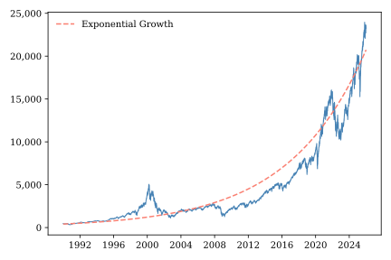
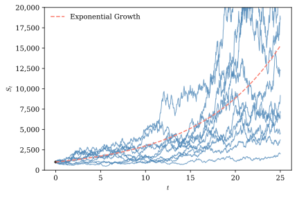
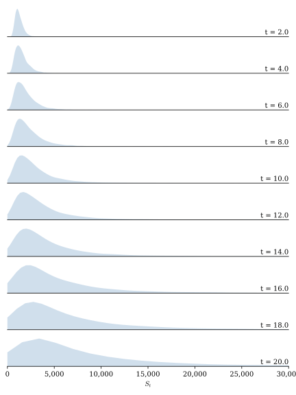

# Itô Calculus {#sec-stochastic_calculus}

In the previous chapter we introduced the Wiener process, which serves as the backbone for most applied work in continuous-time finance. We have seen that Wiener processes are too jagged to be differentiable so we cannot bring the usual calculus toolkit to bare on them directly. In this chapter we develop a new type of calculus, called Itô calculus, that provides the tools we need to work with Wiener processes. To illustrate the use of these tools, we conclude this chapter by deriving properties for geometric Brownian motion (GBM), a stochastic process that is particularly well suited to modeling asset prices.

## The algebra of Wiener differentials {#sec-differentials}

Derivatives of the traditional sort are not well defined in Itô calculus. Instead we make extensive use of differential notation, writing expressions such as $dt$, $dW_t$, and $dX_t$. If your previous exposure to calculus emphasized derivatives as limits of difference quotients, this notation may initially feel unfamiliar. Differential notation provides a compact and intuitive way to describe the behavior of a process over an infinitesimally small time interval, and is particularly useful when manipulating differential equations. It is best to think of $dt$ as representing an infinitesimal increment of time and $dW_t$ as the corresponding infinitesimal increment of a Wiener process. Rather than viewing these as ordinary numbers, we will use them as symbolic objects that encode how different quantities scale over small time intervals. The Big-O notation introduced in the previous chapter will guide these manipulations.[^03-stochastic_calculus-1]

[^03-stochastic_calculus-1]: Technically, the differential notation used in Itô calculus derives from the Itô integral, so a bottom-up development of Itô calculus would present the integral first. However, following the order of material in most traditional calculus expositions, we present differentials first, without formally defining them.

Many calculus results are derived or motivated by taking first-order linear approximations of differentiable functions and showing that higher-order terms are negligible for small values of $dt$. In manipulating differential equations, we typically simply ignore terms that scale at a rate slower than $O(dt)$. For example, consider the ordinary differential equation

$$
dy_t = a + b\,dt.
$$

Suppose we need to work with $(dy_t)^2$. We could write

$$
\begin{align*}
(dy_t)^2 &= (a + b\,dt)^2 \\
&= a^2 + 2\,a\,b\,dt + b^2\,dt^2 \\
&= a^2 + 2\,a\,b\,dt.
\end{align*}
$$

Recognizing that $O(dt^2) < O(dt)$, we set $dt^2 = 0$ and it drops out of the final expression.

In the previous chapter we learned that for a differentiable function $f(t)$, $df(t)$ is of order $O(dt)$ while for a Wiener process $dW_t$ is of order $O(\sqrt{t})$. The steeper scaling of Wiener processes over short time intervals is the fundamental challenge that Itô calculus was designed to overcome.

The scaling rule for $dW_t$ implies that $(dW_t)^2$ is of order $O(dt)$. This is important because it means that if we could somehow differentiate a Wiener process, the scaling of its *second* derivative would be of the same order of magnitude as the scaling of the *first* derivative of an ordinary function. In contrast, the scaling rule for a differentiable function implies that $(df(x))^2$ is of order $O(dt^2)$, so its second derivative scales at a much smaller rate than its first derivative. Thus, while we might safely ignore second-order differentials of differentiable functions, this approach won't work when Wiener processes are involve; they fluctuate so much that one must also account for the effects of second-order terms.

Revisiting our earlier example, suppose we are now faced with the differential equation

$$
dy_t = a + b\,dt + c\,dW_t
$$

and we need to work with $(dy_t)^2$. We have

$$
\begin{align*}
(dy_t)^2 =& (a + b\,dt + c\,dW_t)^2 \\
=& a^2 + 2 a\,b\,dt + 2\,a\,c\,dW_t + 2\,b\,c\,dt\,dW_t \\
& + b^2 dt^2 + c^2\,(dW_t)^2 \\
=& a^2 + 2\,a\,b\,dt + 2\,a\,c\,dW_t + 2\,b\,c\,dt\,dW_t + c^2\,(dW_t)^2.
\end{align*}
$$

The term involving $dt^2$ still drops out, but how should we handle the terms involving $dW_t$, $dt\,dW_t$, and $(dW_t)^2$? Can we use rules like $dt^2 = 0$ for these terms?

Notice that $dt\,dW_t$ is of order $O(dt^{3/2})$ so, applying the logic that we can ignore terms whose order is less than $dt$, we can drop this term. What about $(dW_t)^2$? We have established that it is of order $O(dt)$, so we know we can't drop it. But can we say more?

We learned in the last chapter that a Wiener increment $\Delta W_t$ is normally distributed with mean $0$ and variance $\Delta t$. @thm-noncentral-moments implies that $(\Delta W_t)^2$ has mean $\Delta t$ and variance $2\,(\Delta t)^2$. Consider what happens $(\Delta W_t)^2$ as $\Delta t$ shrinks. Both the mean and the variance drop toward zero, but the variance falls at a much faster rate than the mean.

$$
\begin{align*}
\lim_{\Delta t \to 0}\E\left[\left((\Delta W_t)^2-\Delta t \right)^2\right] =& \lim_{\Delta t \to 0}\Var[(W_t)^2] \\
=& \lim_{\Delta t \to 0} 2\,(\Delta t)^2 \\
=& 0
\end{align*}
$$ 

so $(\Delta W_t)^2 \toms \Delta t$ as $\Delta t \rightarrow 0$. For very small values of $\Delta t$, realizations of $(\Delta W_t)^2$ are so tightly clustered around the mean $\Delta t$ that, to a first approximation, we can treat $(\Delta W_t)^2$ as non-stochastic. We can apply the substitution rule

$$
(dW_t)^2 = dt.
$$

Combining this result with our findings from earlier in this section, @tbl-ito_rules summarizes rules for working with differentials in Itô calculus. The first two rows simply record the scaling behavior of the infinitesimal increments. The remaining rows show how products of differentials behave. Terms whose order is smaller than $O(dt)$ vanish in the limit and are therefore discarded. The only exception is $dW_t^2$, whose order is exactly $O(dt)$. Because Wiener processes have quadratic variation equal to elapsed time, this term survives and is replaced by $dt$. These simple multiplication rules form the algebraic foundation of Itô calculus.[^03-stochastic_calculus-2]

[^03-stochastic_calculus-2]: The observant reader will notice that throughout this chapter the symbol “=” is used in two different ways. When writing equations involving stochastic differentials, expressions such as $(dW_t)^2 = dt$ should not be interpreted as ordinary algebraic identities. Rather, they are convenient shorthand for the limiting behavior of Wiener increments. Once these rules have been established, they may be manipulated algebraically when working with stochastic differential equations.

| Differential Expression | Order          | Itô Multiplication Rule |
|:------------------------|:---------------|:------------------------|
| $dt$                    | $O(dt)$        | Retain                  |
| $dW_t$                  | $O(\sqrt{dt})$ | Retain                  |
| $(dt)^2$                | $O(dt^2)$      | $(dt)^2 = 0$            |
| $dt\,dW_t$              | $O(dt^{3/2})$  | $dt\,dW_t = 0$          |
| $(dW_t)^2$              | $O(dt)$        | $(dW_t)^2 = dt$         |

: Rules for working with Itô differentials. {#tbl-ito_rules}

Applying all of these rules to our earlier example, we have

$$
\begin{align*}
(dy)^2 
=& (a + b\,dt + c\,dW_t)^2 \\
=& a^2 + 2\,a\,b\,dt + 2\,a\,c\,dW_t + c^2\,dt \\
=& a^2 + (2\,a\,b\,dt + c^2)\,dt + 2\,a\,c\,dW_t.
\end{align*}
$$

Looking at the final expression, one sees that it is very similar to an ordinary differential equation. Indeed, were it not for the $dW_t$ term we could solve it by simply integrating both sides with respect to time. We will learn how to deal with $dW_t$ later in this chapter, but right now we're ready to introduce one of the most fundamental and useful results from Itô calculus.

## Ito's Lemma

The Chain Rule appears everywhere in standard calculus. Stated in terms of the differential notation used in working with differential equations, it says that given the function described by

$$
dX_t = \mu_t\,dt
$$

and a smooth function $y = f(x)$,

$$
dy_t = f'(X_t)\,\mu_t\,dt.
$$

We can informally demonstrate the Chain Rule by taking a Taylor series expansion of $f(X_t)$,

$$
\begin{align*}
f(X_t) =& f'(X_t)\,dX_t + \frac{1}{2}f''(X_t)(dX_t)^2 + \ldots \\
=& f'(X_t)\,\mu_t\,dt + \frac{1}{2}f''(X_t)\mu_t^2\,dt^2 \ldots ,
\end{align*}
$$

and recognizing that all terms beyond the first one can be dropped because they are of order smaller than $O(dt)$.

But what if $X_t$ involves a Wiener process? We have seen that Wiener process differentials do not scale in the same way as differentials of smooth functions, so one suspects that there might be complications.

Suppose

$$
dX_t = \mu_t\,dt + \sigma_t\,dW_t.
$$

We know that the Taylor expansion of $f(X_t)$ will give us a series of terms involving $dX_t$, $(dX_t)^2$, $(dX_t)^3$, etc. Applying the rules of @tbl-ito_rules, we can see that

$$
dX_t = \mu_t,dt + \sigma_t\,dW_t
$$

is of order $O(\sqrt{dt})$. While

$$
\begin{align*}
(dX_t)^2 =& (\mu_t dt + \sigma_t dW_t)^2 \\
=& \mu_t^2\,dt^2 + 2\mu_t\,\sigma_t\,dt\,dW_t + \sigma_t^2\,W_t^2 \\
=& \sigma_t^2\,dt
\end{align*}
$$

is of order $O(dt)$. And

$$
\begin{align*}
(dX_t)^3 =& (\mu_t\,dt + \sigma_t\,dW_t)^3 \\
=& \mu_t^3dt^3 + 3\mu_t^2\,\sigma_t\,dt^2\,dW_t + 3\mu_t\,\sigma_t^2\,dt\,dW_t^2 + \sigma_t^3\,W_t^3 \\
=& 0.
\end{align*}
$$

Is of order less than $O(dt)$. It should be clear that for all $n>3$, $(dX_t)^n$ is also of order less than $O(dt)$.

With these results in hand, we can use a Taylor series expansion to derive an expression for $df(X_t)$.

$$
\begin{align*}
df(X_t) =& f'(X_t)\,dX_t + \frac{1}{2}f''(X_t)(dX_t)^2 + \ldots \\
=& f'(X_t)\,(\mu_t,dt + \sigma_t\,dW_t) + \frac{1}{2}f''(X_t)\,(\sigma_t^2\,dt) \\
=& \left(f'(X_t)\,\mu_t,dt + \frac{1}{2}f''(X_t)\,(\sigma_t^2\right)dt + f'(X_t)\,\sigma_t\,dW_t.
\end{align*}
$$

This is a slightly simplified version of Ito's Lemma, the Itô calculus analogue of the Chain Rule. It is straightforward to generalize this result to allow $f$ to depend directly on $t$ as well as $X_t$. This more general form of Ito's Lemma can be stated as follows.

::: {.callout-note title="Ito's Lemma"}
Suppose the stochastic process $\{X_t\}$ satisfies the stochastic differential equation

$$
dX_t = \mu_t\,dt + \sigma_t\,dW_t,
$$

and let

$$
f(t,x)
$$

be a function that is continuously differentiable in $t$ and twice continuously differentiable in $x$.

Then the process

$$
Y_t = f(t,X_t)
$$

satisfies

$$
df(t,X_t)
=
\frac{\partial f}{\partial t}\,dt
+
\frac{\partial f}{\partial x}\,dX_t
+
\frac{1}{2}
\frac{\partial^2 f}{(\partial x)^2}
(dX_t)^2,
$$

or equivalently,

$$
df(t,X_t)
=
\left(
\frac{\partial f}{\partial t}
+
\mu_t
\frac{\partial f}{\partial x}
+
\frac{1}{2}
\sigma_t^2
\frac{\partial^2 f}{(\partial x)^2}
\right)
dt
+
\sigma_t
\frac{\partial f}{\partial x}
\,dW_t.
$$
:::

Ito's Lemma is used as often in stochastic calculus as is the Chain Rule in traditional calculus. It is worth taking a moment to consider why the two rules differ. Ito's Lemma contains an extra second derivative term, reflecting that in order to construct a linear approximation of $f(t,X_t)$ we must account for the fact that the Wiener process in $X_t$ fluctuates more dramatically over time than a differentiable function.

The stochastic differential equation

$$
dX_t = \mu_t\,dt + \sigma_t\,dW_t,
$$

defines a broad class of stochastic processes referred to collectively as **Itô processes**. $\mu_t$ is called the drift of the process, and describes its expected instantaneous rate of change. $\sigma_t$ is the volatility of the process, which determines the magnitude of its random fluctuations.

The Wiener process is one example of an Itô process, of course, but there are many others. The coefficients $\mu_t$ and $\sigma_t$ are quite flexible and could include constants such as $\mu$, deterministic functions of time such as $\mu(t)$, stochastic processes that depend on both time and state such as $\mu(t,X_t)$, or even more general stochastic processes. As a result most of the stochastic processes used in continuous-time finance are members of this class.

## The Itô Integral

In the calculus of deterministic functions we use Riemann integrals of the form

$$
\int_0^T f(t)dt = \lim_{n\to\infty} \sum_{i=0}^{n-1} f(t_i)\,\Delta t_i
$$

to compute the area under a curve by aggregating the areas of small vertical slices over $t$. Thanks to the Fundamental Theorem of Calculus, the Riemann integral is an indispensable tool for solving differential equations, as it often allows us to infer the trajectory of a path over time from its slope. A generalization of the Riemann integral, the Riemann-Stieltjes integral, of the form

$$
\int_0^T f(t)dg(t) = \lim_{n\to\infty} \sum_{i=0}^{n-1} f(t_i)\,\Delta g(t_i),
$$

weights values of $f(t)$ by increments of an integrator function $g(t)$. Somewhat less common than Riemann integrals, Riemann-Stieltjes integrals are widely used in probability and statistics to compute expectations of continuous random variables.

When working with stochastic processes, we use the Itô Integral.

::: {.callout-note title="Itô Integral"}
Let $X_t$ be an adapted Itô process and divide the interval $[0,T]$ into $n$ subintervals

$$
0=t_0<t_1<\cdots<t_n=T
$$

so that $\Delta W_{t_i} = W_{t_{i+i}}-W_{t_i}$ is the Wiener increment corresponding to subinterval $[t_i,t_{i+1}]$.

The **Itô integral** is defined as the limit

$$
\lim_{n\to\infty} I_n \eqms I = \int_0^T X_t\,dW_t 
$$

where

$$
I_n = \sum_{i=0}^{n-1} X_{t_i} \Delta W_{t_i},
$$

provided that this limit exists.
:::

In one hand, the Itô integral looks quite similar to the Riemann and Riemann-Stieltjes integrals we are already familiar with. On the other hand, what the heck! What does it mean to take the integral of a stochastic process with respect to another stochastic process?

We can ease the transition from deterministic to stochastic integrals and build some intuition by considering a few special cases. Recalling that a deterministic function is simply a relatively uninteresting example of a stochastic process, suppose that $X_t = 1$. In this case

$$
I_n = \left(W_{t_1} - W_{t_0}\right) + \left(W_{t_2} - W_{t_1}\right) + \ldots + \left(W_{T} - W_{t_{n-1}}\right) = W_T
$$

so

$$
\int_0^T dW_t = W_T \sim N(0,T).
$$

Just as with the Riemann-Stieltjes integral, applying the Itô integral to the constant one simply returns the difference in the integrator evaluated at the limits of integration. But, in this case, the integrator is a Wiener process so the Itô integral evaluates to a random variable.

In fact, Itô integrals of most of the deterministic functions we are likely to encounter evaluate to normal random variables. To see this, notice that when the integrand is a deterministic function $f(t)$,

$$
I_n = \sum_{i=0}^{n-1}f(t_i)\,\Delta W_{t_i}
$$

which is just a weighted sum of Wiener increments. The $i$th term in the series is

$$
f(t_i)\,\Delta W_{t_i} \sim N\left(0,f(t_i)^2\,(t_{i+1}-t_i)\right),
$$

so we are just summing over normal random variables. A sum of normal variables is itself normal, and, since each term has mean zero, we know that the Itô integral must be normally distributed with mean zero. Furthermore, since all non-overlapping Wiener intervals must be independent of one another,

$$
\begin{align*}
\Var\left[I_n\right] =& \Var\left[ \sum_{i=0}^{n-1}f(t_i)\,\Delta W_{t_i}\right] \\
=&  \sum_{i=0}^{n-1}\Var\left[f(t_i)\,\Delta W_{t_i}\right] \\
=&  \sum_{i=0}^{n-1}f(t_i)^2\,(t_{i+1}-t_i), 
\end{align*}
$$

and

$$
\Var[I] = \Var\left[\lim_{n\to\infty} I_n\right] = \lim_{n\to\infty} \Var[I_n] = \int_0^T f(t)^2dt.
$$

Putting it all together, if $f(t)$ is a deterministic function then

$$
\int_0^T f(t)\,dW_t \sim N\left(0,\int_0^T f(t)^2\,dt\right)
$$

provided the variance integral exists.

There are two important differences between Itô integrals and the Riemann and Riemann-Stieltjes integrals of traditional calculus. First, as discussed in @sec-convergence_concepts, a traditional pathwise approach to integration does not work because the Wiener process is too erratic. For this reason, the Itô integral relies on mean squared rather than almost sure convergence. Second, in moving from deterministic to stochastic integrals, we must address the subtle issue of timing.

When $X_t$ is an Itô process each term of $I_n$ is the product of two random variables, so we cannot interpret the Itô integral as the weighted sum of Wiener increments. To make the integral tractable, we must be able to treat $X_{t_i}$ as though it were deterministic at the time it interacts with $\Delta W_{t_i}$. To ensure that this is the case, we impose the condition that $X_{t_i}$ be adapted to the Wiener filtration, meaning that it depends only on information up to time $t_i$. More succinctly, $X_{t_i}$ must be known as of time $t_i$. If this is true then $\Delta W_{t_i}$ is independent of $X_{t_i}$ and we can apply much of the same reasoning we have already developed for deterministic integrands. This is why, in contrast to the Riemann and Riemann-Stieltjes integrals, it is critical that the integrand $X_{t}$ be evaluated at the left end of each of the $[t_i, t_{i+1}]$ time subintervals.

When the integrand is an adapted stochastic process the Itô integral still evaluates to a random variable, but not necessarily a normally distributed one. The reason is that each coefficient, $X_{t_i}$, in $I_n$ is random. Conditional on a realized path $X_t(\omega)$ the integral is normal, but once we average over all possible paths the resulting random variable has a normal mixture distribution. Nonetheless, we can compute the mean and variance of $I$.

If $X_i$ is adapted then its conditional expectations at time $t$ is

$$
\E_t\left[X_t\right] = X_t.
$$

Applying the Law of Iterated Expectations yields

$$
\begin{align*}
\E\left[I_n\right] =& \E\left[ \sum_{i=0}^{n-1}X_{t_i}\,\Delta W_{t_i}\right] \\
 =& \E\left[ \sum_{i=0}^{n-1}\E_t\left[X_{t_i}\,\Delta W_{t_i}\right]\right] \\
 =& \E\left[ \sum_{i=0}^{n-1}X_{t_i}\,\E_t\left[\Delta W_{t_i}\right]\right] \\
=& 0
\end{align*}
$$

so $\E\left[I\right] = 0$. Following similar logic

$$
\begin{align*}
\E\left[I_n^2\right] =& \E\left[ \left(\sum_{i=0}^{n-1}X_{t_i}\,\Delta W_{t_i}\right)^2\right] \\
 =& \E\left[\sum_{i=0}^{n-1}\sum_{j=0}^{n-1} X_{t_i}\,X_{t_j}\,\Delta W_{t_i}\,\Delta W_{t_j} \right] \\
  =& \E\left[\sum_{i=0}^{n-1}\sum_{j=0}^{n-1} \E_t\left[X_{t_i}\,X_{t_j}\,\Delta W_{t_i}\,\Delta W_{t_j} \right] \right] \\
  =& \E\left[\sum_{i=0}^{n-1}\sum_{j=0}^{n-1} X_{t_i}\,X_{t_j}\E_t\left[\Delta W_{t_i}\,\Delta W_{t_j} \right] \right] \\
  =& \E\left[\sum_{i=0}^{n-1} X_{t_i}^2\,\left(t_{i+1}-t_i\right) \right],
\end{align*}
$$

and therefore

$$
\begin{align*}
\Var[I] =& \E\left[\left(\lim_{n\to\infty} I_n\right)^2\right] \\
 =& \lim_{n\to\infty} \E\left[I_n^2\right] \\
 =& \lim_{n\to\infty} \E\left[\sum_{i=0}^{n-1} X_{t_i}^2\,\left(t_{i+1}-t_i\right) \right] \\
 =& \E\left[\lim_{n\to\infty} \sum_{i=0}^{n-1} X_{t_i}^2\,\left(t_{i+1}-t_i\right) \right] \\
 =& \E\left[\int_0^T X_{t}^2\,dt \right].
\end{align*}
$$

This beautiful result is called the **Itô Isometry**.

In this section we have derived some powerful tools for working with Itô Integrals. To summarize, when the integrand is a deterministic function $I$ evaluates to a normal random variable with mean zero and a variance we can calculate by integrating over the square of the integrand. When the integrand is a more general adapted Itô process, we may not be able to easily determine the distribution of $I$, but we are assured that it has zero mean and a variance we can express using the Itô Isometry.

## Example: Geometric Brownian motion {#sec-gbm}

@fig-nasdaq shows the NASDAQ composite stock index since 1990. This data could not be modeled effectively by a process with a constant linear drift term because equity prices exhibit *exponential growth*. That is, they typically rise or fall by an amount proportional to their current level. Ignoring uncertainty for the moment, we can model the NASDAQ's dynamics as a constant *growth rate*

$$
\frac{dS_t}{S_t} = \mu.
$$

This simplest of differential equations is easily solved by recognizing that $d\ln(S)/ds = 1/S$ so we can rewrite the differential equation in terms of $d\ln(S)$ and integrate both sides:

$$
\begin{align*}
\frac{dS_t}{S_t} =& \mu \\
d \ln(S_t) =& \mu \\
\int_0^T \ln(S_s)ds =& \int_0^T \mu ds \\
\ln(S_T) - \ln(S_0) =& \mu\,T + C.
\end{align*}
$$

Given an initial value $S_0$ , $C=0$. Rearranging terms yields the exponential growth curve

$$
S_T = S_0 e^{\mu T}
$$

shown in @fig-nasdaq by the dashed red line.^[For the fitted curve, $S_0$ is the average level of the NASDAQ index in 1990 and $\mu$ is the average annual growth rate from 1990 to 2026.] This deterministic function can describe the long-run trend in the NASDAQ index but it cannot capture its fluctuations.

{#fig-nasdaq}

To incorporate uncertainty into our model of equity prices, we can add a Wiener process to the dynamic growth equation:

$$
\frac{d S_t}{S_t} = d \ln(S_t) = \mu\,t + \sigma\,W_t.
$$

Solving this SDE involves a set of steps very similar to those we used to solve the exponential growth ODE.

$$
\frac{\partial \ln(S)}{\partial t} = 0,
$$

$$
\frac{\partial \ln(S)}{\partial S} = \frac{1}{S},
$$

and

$$
\frac{\partial^2 \ln(S)}{(\partial S)^2} = - \frac{1}{S^2}
$$

so, by Ito's Lemma,

$$
\begin{align*}
d\ln(S) &= 0\,dt + \frac{1}{S}\,dS + \frac{1}{2}\left(- \frac{1}{S^2}\right)(dS)^2 \\
&= \frac{1}{S}\,dS - \frac{1}{2S^2}(dS)^2.
\end{align*}
$$

The $dS$ term is defined by the dynamic growth equation while the $(dS)^2$ term simplifies substantially. Applying the differential rules of @tbl-ito_rules produces

$$
\begin{align*}
(dS)^2 &= (\mu S\,dt + \sigma\,S\,d W)^2 \\
&= \mu^2\,S^2\,(dt)^2 + 2\,\mu\,\sigma\,S^2\,(dt\,dW) + \sigma^2\,S^2\,(dW)^2 \\
&= \sigma^2\,S^2\,dt
\end{align*}.
$$

Substituting $dS$ and $(dS)^2$ into the result from Itô's Lemma yields

$$
\begin{align*}
d \ln(S) &= \frac{1}{S}(\mu S dt + \sigma S dW) - \frac{1}{2S^2}(\sigma^2 S^2 dt) \\
&= \left(\mu - \frac{1}{2}\sigma^2\right)dt + \sigma dW.
\end{align*}
$$

And integrating both sides gives us

$$
\begin{align*}
\int_0^T d f(S) &= \int_0^T\left(\mu - \frac{1}{2}\sigma^2\right)dt + \int_0^T\sigma dW_t \\
\ln(S_T) - \ln(S_0) &= \left(\mu - \frac{1}{2}\sigma^2\right)T + \sigma W_T \\
\ln(S_T) &= \ln(S_0) + \left(\mu - \frac{1}{2}\sigma^2\right)T + \sigma W_T.
\end{align*}
$$

This constitutes a **pathwise solution** to the SDE. We have expressed $S_T$ as a function of the initial condition, $S_0$, and the underlying sources of randomness.  This is typically sufficient for simulation and theoretical analysis. For example, we could simulate GBM growth rate paths by plugging simulated realizations of $W_T$ into the equation above. Often we can go a step father, however. The **transition distribution** of a stochastic process describes the probability distribution of its future value given its current level. Knowing a process's transition distribution can make simulation easier and more robust, and can enable us to derive stronger or more general theoretical results.

In the case of GBM, deriving the transition distribution from the pathwise solution is straightforward. The only stochastic element in the pathwise solution is the Wiener process, $W_T$, which we know has a normal distribution with mean $0$ and variance $T$. Thus

$$
\ln(S_T) \sim N\left(\ln(S_0) + \mu - \frac{1}{2}\sigma^2, \sigma^2 T\right)
$$

and $S_T$ itself has a lognormal distribution. This transition distribution provides an analytic expression for the probability density of $S_t$ at any point in time, as well as all its moments. In @sec-q_measure_bs we will show how this transition solution can be used to value options on $S_t$.

::: {.callout-tip title="Geometric Brownian Motion"}
A **geometric Brownian motion (GBM)** is an Itô process whose drift and diffusion are both proportional to the current value of the process. It satisfies the stochastic differential equation

$$
dS_t = \mu S_t\,dt + \sigma S_t\,dW_t,
$$

where $\mu$ is the drift parameter, $\sigma$ is the volatility parameter, and $W_t$ is a standard Wiener process.

The solution to this stochastic differential equation is

$$
S_t=S_0
\exp\!\left[
\left(\mu-\frac{1}{2}\sigma^2\right)t
+
\sigma W_t
\right].
$$

Consequently, the conditional distribution of the process at time $t$ is

$$
\ln(S_t)\mid S_0
\sim
N\!\left(
\ln(S_0)
+
\left(\mu-\frac{1}{2}\sigma^2\right)t,\,
\sigma^2 t
\right),
$$

or equivalently,

$$
S_t\mid S_0
\sim
\operatorname{Lognormal}\!\left(
\ln(S_0)
+
\left(\mu-\frac{1}{2}\sigma^2\right)t,\,
\sigma^2 t
\right).
$$
:::

@fig-gbm_paths_nasdaq shows geometric Brownian motion process paths calibrated to the same growth rate and volatility as the NASDAQ index. For comparison we have overlaid a deterministic exponential growth curve using the same growth rate parameter. Note the similarity between these paths and the realized path of the NASDAQ in @fig-nasdaq. The lognormal distribution is skewed to the right and its variance increases in proportion to its mean, as can be seen in the density plots of GBM process shown in @fig-gbm_dist_nasdaq.

{#fig-gbm_paths_nasdaq}

{#fig-gbm_dist_nasdaq}

## Taking stock and looking forward

In this chapter we took a whirlwind tour of the tools of Ito calculus and showed how they can be used to model the random evolution of assets whose values tend to fluctuate in proportion to their level.  From this simple example, it should be apparent that Wiener processes provide a more flexible basis for describing uncertainty over time than might have initially been apparent.  By transforming Wiener processes in various ways we can describe a broad range of different types of random processes, with features appropriate to the particular application at hand.  In the next chapter we will apply some the math we've learned to determine the market value of financial derivatives using the most famous continuous-time asset pricing model of all time. 
