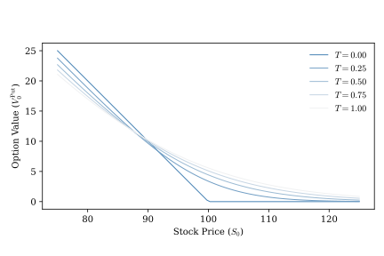
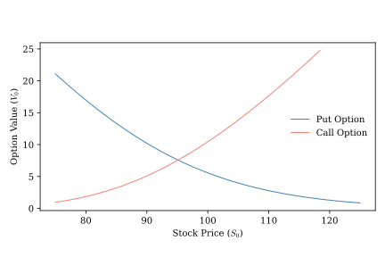

# No Arbitrage Pricing and the Risk-Neutral Measure {#sec-risk_neutral_measure}

Having introduced some basic terminology and tools needed for working with stochastic processes, we are now ready to shift gears and show how these tools can be applied to value assets such as stocks, bonds, and derivatives.

Much of asset pricing boils down to the following question: given a model for the value of a set of assets, how can we determine the value of another asset whose future cash flows depend on them? To make this idea a little more concrete, suppose we have access to a risk-free money-market account, a stock, and derivative with payoffs that tied to the future price of the stock. The money market account pays a known interest rate that reflects the time value of money. Assume we also know the value of the stock today and we have a model that allows us to assign probabilities to realizations of the stock's future values. How can we use this information to determine the price of the derivative today?

At first blush, the answer might seem straightforward. We could simply take the average of the net present value of all possible future payoffs of the derivative weighted by the probabilities of the future values of the stock necessary to achieve those outcomes. That is, we could take the expected present value of the derivative payoffs given our probability model. This approach is intuitive and corresponds to the way we usually think about dealing with uncertainty in the physical world, but it ignores something important.

Most people don't like risk and expect to be compensated for taking it. Most investors would not be indifferent between an investment that pays off \$100 with certainty and another that pays off either \$50 or \$150 depending on the flip of a fair coin. Risk averse investors would value the certain investment more richly than the uncertain one. Likewise, the value of the derivative in our example will depend on the uncertainty of its future payouts, not just their average level.

So if we can't simply use the derivative's expected present value, how can we price it? As we'll see in this chapter, there are two equivalent approaches: one based on a hedging portfolio and the other based on reweighing outcome probabilities. Both approaches are founded on the assumption of **no arbitrage**; it should not be possible to construct an investment strategy that produces positive expected net cash flows with no risk of loss. If such a strategy existed, then an investor could take on leverage, deploy the strategy, and produce unbounded wealth. The no arbitrage condition is the finance analogue of the physics notion that you can't build a perpetual motion device.

The first approach to pricing derivatives involves constructing a risk-free portfolio whose value depends on that of the derivative and the underlying tradable assets. We can then use the fact that in the absence of arbitrage this risk-free portfolio must pay the same return as a risk-free investment to determine the portfolio's value, and hence the value of the derivative. As it turns out, this approach is equivalent to taking the expected present value of the derivative using probability weights that have been adjusted to compensate investors for uncertainty.

## Dynamic hedging and the Black-Scholes model {#sec-hedging_portfolio}

In a now famous pair of research papers @black1973pricing and @merton1973theory articulated the hedging portfolio approach to asset pricing. They argued that if one can construct a risk-free portfolio consisting of traded assets and the derivative one is trying to price, then this portfolio must grow in value at a rate equal to the risk-free rate of return. If it paid a higher return investors could borrow from the bank, invest in the portfolio, and earn risk-free profits. Likewise, if it paid less than the risk-free rate, investors could borrow from the bank, short the portfolio, and again earn risk-free profits. In both cases, the no arbitrage condition would be violated. The rate of change in the value of the hypothetical risk-free portfolio is a function of the rate of change in the value of the assets it contains. The no arbitrage condition tells us what this rate of change must be, giving us one equation and one unknown: the value of the derivative. Solving this equation allows one to express the value of the derivative as a function of the values of the traded assets and the risk-free rate of return. Of course, this entire argument hinges on the assumption that one can construct a risk-free portfolio. Black, Scholes, and Merton showed how this can be done.

The simplest version of the Black-Scholes model involves three assets: a risk-free bank account that pays a risk-free rate of return $r$ over time, a stock that follows the GBM process

$$
dS = \mu\,S\,dt + \sigma\,S\,dW,
$$

and a derivative whose value depends on $S$ and time according to the smooth function

$$
V = V(S,t).
$$

The specific details of $V(S,t)$ depend on the derivative contract we wish to value. We can learn about the change in $V(S,t)$ over time by applying Ito's Lemma:

$$
dV = \left(\pd{V}{t} + \mu\,S\,\pd{V}{S} + \frac12 \sigma^2\,S^2\,\pdd{V}{S}\right)dt + \sigma\,S\,\pd{V}{S}\,dW.
$$

Now we can construct a portfolio $\Pi$ consisting of a long position in the derivative and a short position in the stock: 

$$
\Pi = V - \Delta S.
$$

$\Delta$, the hedge ratio, is a parameter that we are free to choose. Over time we neither add nor remove assets from the portfolio so that any gains or losses in the portfolio are due to changes in the underlying asset values. This implies that 

$$
\begin{align*}
d\Pi =& dV - \Delta dS \\
=& \left(\pd{V}{t} + \mu\,S\,\pd{V}{S} + \frac12 \sigma^2\,S^2\,\pdd{V}{S}\right)dt + \sigma\,S\,\pd{V}{S}\,dW \\
&- \Delta \left( \mu\,S\,dt + \sigma\,S\,dW \right) \\
=& \left(\pd{V}{t} + \mu\,S\left(\pd{V}{S}-\Delta\right) + \frac12 \sigma^2\,S^2\,\pdd{V}{S}\right)dt \\
&+ \sigma\,S\,\left(\pd{V}{S}-\Delta\right)dW.
\end{align*}
$$

For arbitrary values of $\Delta$ the change in the portfolio's value over small time increments involves a drift term and a stochastic term. However, if we choose

$$
\Delta = \pd{V}{S}
$$

something remarkable happens. In this case

$$
d\Pi= \left(\pd{V}{t} + \frac12 \sigma^2\,S^2\,\pdd{V}{S}\right)dt
$$

and the stochastic term completely vanishes! We have chosen exactly the hedge ratio needed to cancel out the effects of the Wiener process embedded in $S$. Note that for most derivatives the hedge ratio is not constant over time; it must be adjusted dynamically as $S$ evolves. The resulting portfolio is locally risk free, meaning that over small increments of time its value does not depend on the random fluctuations in $S$.

Now we can make use of the no arbitrage condition that underpins all asset pricing. Over small increments of time our locally risk-free portfolio must earn the risk-free rate of return, $r$. No arbitrage implies that

$$
\begin{align*}
d\Pi =& \Pi\,r\,dt\\
=& \left(V-\pd{V}{S}S\right)\,r\,dt.
\end{align*}
$$

We have now derived two expressions for $d\Pi$: one which grew out of our construction of a locally-risk-free portfolio, and one derived from the fact that such a portfolio must yield the risk-free rate of return. Putting these two expressions together and rearranging terms yields

$$
\pd{V}{t} + \frac12 \sigma^2\,S^2\,\pdd{V}{S} + \pd{V}{S}\,S\,r - V\,r = 0.
$$

This is the celebrated Black-Scholes pricing equation. Before putting it to use, it is worth pausing to reflect on some of its key properties. First, observe that this is a deterministic partial differential equation. Although the stock value, $S$, follows a stochastic differential equation, over short increments of time the derivative's value depends only on the current level of $S$. Second, the result is quite general. We have not yet said anything about the details of the derivative we seek to price beyond that it depends on a smooth function of $S$ and $t$. This formula can be used to price a wide variety of derivative products. Finally, notice that the stock's drift term, $\mu$, does not appear in the Black-Scholes equation. This reflects a deep economic insight: because the derivative can be perfectly hedged, investors require no compensation for bearing stock price risk. Once the risk has been eliminated only the risk-free rate remains.

## Valuing put and call options {#sec-hedging_bs}

To see how we can apply the Black-Scholes formula in practice, consider a simple European put option that gives the owner the opportunity to sell a stock $S$ at the strike price $K$ on date $T$. When the contract matures the option holder will purchase the stock and deliver it to the option seller for the strike prices if $S_T < K$, otherwise she will do nothing. Thus the terminal value of the put option is

$$
V_T^{\text{Put}} = \max\left(K-S_T, 0\right).
$$

This is a boundary condition needed to pin down a solution to the Black-Scholes PDE.

Solving the PDE, while not excessively difficult, is somewhat tedious. It involves a number of mathematical steps that transform the Black-Scholes formula into the heat equation, a PDE from physics with a well-known solution. As solving such PDEs is not the focus of this book, we simply state the solution here.

$$
V_t^{\text{Put}} = K\,e^{-r(T-t)}\,\Phi(-d_2)
- S_t\,\Phi(-d_1),
$$

where $\Phi(\cdot)$ is the standard normal cumulative density function,

$$
d_1 =
\frac{\ln\left(\frac{S_t}{K}\right) +
\left(r+\frac{1}{2}\sigma^2\right)(T-t)}
{\sigma\,\sqrt{T-t}},
$$

and

$$
d_2 =d_1-\sigma\,\sqrt{T-t}.
$$

A European call option that gives the holder the right to buy the stock for the strike price $K$ at time $T$ can be valued using the same approach. The value of the call option is

$$
V_t^{\text{Call}} = S_t\,\Phi(d_1) - K\,e^{-r(T-t)}\,\Phi(d_2).
$$

While more sophisticated models are used to value stock options today, we can gain a lot of intuition for the economics of equity options by examining these Black-Scholes solutions. @fig-bs_put_payoff shows how time-to-maturity and the initial stock price affects the value of a put option. The put option performs like an insurance contract against the risk that the value of the stock will fall. Its terminal value moves in the opposite direction as $S_T$ and can never fall below zero. All else equal, a higher strike price implies a higher value for the put option at every point in time because it increases the likelihood and magnitude of potential payouts when the contract matures. Conversely, the put option's value at time $t$ is a decreasing function of $S_t$ because a higher value for the stock today means that positive terminal payouts are less likely and will tend to be smaller in magnitude if they occur.

{#fig-bs_put_payoff}

Changes in the values of $K$ and $S_t$ affect the value of the call option in exactly the opposite way because the call option acts as a hedge against large increases in the stock price. @fig-bs_put_call shows the value of a European put and call option as a function of the current stock price. The put option is more valuable when the stock price is low, while the call option is more valuable when the stock price is high. If an investor buys both a put and a call at the strike price $K$, she is guaranteed a payout equal to the difference between the stock price at maturity and the strike price. This gives rise to the put-call parity condition 

$$
V_t^{\text{Call}} - V_t^{\text{Put}} = S_t - e^{-r(T-t)}K.
$$ 

The two options have equal value when $S_0 = e^{-rT}K$, the discounted present value of the strike price.

{#fig-bs_put_call}

## Risk-neutral pricing

The hedging portfolio argument we have developed up to this point provides the theoretical foundation for derivative pricing and demonstrates how no-arbitrage leads to a unique price. In practice, however, relatively few pricing problems are solved by integrating partial differential equation such as the one developed by Black and Scholes. As it turns out, the Black–Scholes equation has an equivalent probabilistic representation that expresses the price of a derivative as the discounted expected value of its future payoff under an appropriately chosen probability measure. This fact is true more broadly, giving rise to a valuation framework that is often more easily extended to complex derivative pricing situations.

In working through the Black-Scholes hedging portfolio model we learned something remarkable. Once we invoked the no-arbitrage principle, the stock’s drift parameter no longer influenced the price of the derivative. This suggests that the particular value of the stock's expected return is not fundamental to derivative pricing. If we could reformulate the stock price process so that its expected return were simply the risk-free rate, the pricing problem might become considerably simpler. The First and Second Fundamental Theorems of Asset Pricing show that this is indeed possible and is, in fact, equivalent to the hedging portfolio approach we have already developed.

::: {.callout-note title="First and Second Fundamental Theorems of Asset Pricing"}

1.  A market is free of arbitrage if and only if there exists an equivalent martingale measure $Q$ under which discounted asset prices have no expected growth.

2.  If a market is free of arbitrage and complete, then the equivalent martingale measure $Q$ is unique.
:::

The First and Second Theorems are so tightly bound together that they are often referenced collectively with the acronym FTAP. The two theorems are rather dense with terminology, so let's unpack them in detail.

The first theorem establishes a connection between the **physical probability measure**, $P$, that we normally work with and an alternative **risk-neutral probability measure**, $Q$, that can be used for asset pricing. The risk-neutral measure is "equivalent" to the physical measure in the sense that it assigns positive probability to the same events as the physical measure, though the magnitudes of these probabilities may differ.

The $Q$ measure has the rather magical property that if we use it to compute the expected present value of an asset at time $t$, we will get that asset's current value. For example, the value of the stock in the Black-Scholes model we just derived can be expressed as

$$
S_t = \E^Q_t\left[e^{-r(T-t)}S_T\right]
$$

where $\E^Q\left[\cdot\right]$ denotes an expectation computed under the risk-neutral probability measure. Another, nearly equivalent, way of stating the martingale condition is that under the risk-neutral measure an asset's expected growth rate at any point in time must equal the risk-free return.[^04-risk_neutral_expectations-1] That is

[^04-risk_neutral_expectations-1]: Technically, this condition is slightly weaker than the one implied by the First Fundamental Theorem of Asset Pricing. It implies that the stochastic process is a **local martingale** rather than a martingale. All martingales are local martingales, but not all local martingales are martingales. In practice, however, this distinction is not likely to be important for most of the stochastic processes encountered in applied work.

$$
\E_t^Q\left[\frac{dS_t}{S_t}\right] = r\,dt.
$$

The First Theorem is tremendously useful because it implies that if we know the $Q$ measure, we cannot only compute the value of traded assets whose value we have presumably modeled, we can also compute the value of derivatives of those assets. So, for example,

$$
V_t^\text{Put} = \E_t^Q\left[e^{r\,(T-t)}\,V_T^\text{Put}\right].
$$

The Second Theorem states that if the market is complete then there is only one valid risk-neutral measure. In a **complete market** every contingent claim can be replicated by a portfolio of traded assets. The price of a claim is then uniquely determined by the no-arbitrage condition. In the Black-Scholes model we were able to construct a risk-free hedging portfolio because the market was complete. Had the value of the stock been influenced by additional sources of uncertainty we would not have been able to construct such a portfolio, there would have been multiple possible risk-neutral measures, and the price of the derivative would not have been uniquely determined by the no-arbitrage condition. We will see examples of incomplete markets later in this book.

With the FTAP in hand we do not need to explicitly construct a hedging portfolio to value a derivative. Instead, derivative pricing can proceed in two stages. First, we determine a $Q$-measure process that makes the present value of traded assets a martingale. Then, given a derivative's payoff function, we compute the discounted expected value of the derivative's future payoffs under the $Q$ measure to determine its price.

Of course, in practice this strategy may be easier said than done. The FTAP guarantees the existence of a risk-neutral measure, but it does not tell us how to find it. For that, we need Girsanov's theorem, which provides a very convenient way of moving between equivalent probability measures when we are working with Wiener processes.[^04-risk_neutral_expectations-2]

[^04-risk_neutral_expectations-2]: The version of Girsanov's theorem presented here is specialized to one-dimensional Wiener processes. More general versions apply to multidimensional diffusion processes and are formulated in terms of Radon--Nikodym derivatives. These extensions are not required for the models considered in this book.

::: {.callout-note title="Girsanov's Theorem (Similified)"}
Suppose that $W_t^P$ is a Wiener process under the probability measure $P$. Under suitable regularity conditions, there exists an equivalent probability measure $P'$ such that

$$
dW_t^{P'} = dW_t^P + \lambda_t\,dt,
$$

where $\lambda_t$ is an adapted process.

Equivalently,

$$
dW_t^P = dW_t^{P'} - \lambda_t\,dt.
$$

In other words, changing the underlying probability measure changes the drift of the Wiener process while preserving its random fluctuations. Although $W_t^P$ and $W_t^{P'}$ describe the same underlying source of randomness, they are Wiener processes with respect to different probability measures.
:::

Girsanov's Theorem allows us to change the drift of a stochastic process by changing the underlying probability measure. For derivative pricing problems involving Wiener processes, we can use Girsanov's Theorem to select a probability measure $Q$ consistent with the martingale pricing result of the FTAP. Under $Q$, all traded assets earn the risk-free rate in expectation, which greatly simplifies the derivative pricing problem. In the next section we will illustrate the application of this approach to price derivatives in the Black-Scholes model.

## Geometric Brownian motion under the risk neutral measure {#sec-q_bs_derivation}

In the Black-Scholes model the stock price follows a geometric Brownian motion (GBM) process under the physical measure $P$:

$$
dS_t = \mu\,S_t\,dt + \sigma\,S_t\,dW_t^P.
$$

Girsanov's Theorem allows us to change the drift of the Wiener process by changing the underlying probability measure. In particular, we can select a risk-neutral measure $Q$ such that

$$
dW_t^Q = dW_t^P + \frac{\mu-r}{\sigma}\,dt.
$$

The quantity $(\mu-r)/{\sigma}$ is called the market price of risk. Substituting $dW_t^Q$ into the physical SDE gives 

$$
dS_t = r\,S_t\,dt + \sigma\,S_t\,dW_t^Q,
$$

so under the $Q$ measure the stock price follows a GBM process with drift equal to the risk-free rate. This is exactly what we want.

We can confirm that the discounted stock price is a local martingale under the $Q$ measure by applying Itô's Lemma to the discounted stock price process. The discounted value of $S_t$ as of $t=0$ is 

$$
\tilde S_t = e^{-rt}S_t.
$$

Observe that 

$$
\pd{\tilde S_t}{t} = -r\,e^{-rt}\,S_t,
$$ 

$$
\pd{\tilde S_t}{S} = e^{-rt},
$$ 

and 

$$
\pdd{\tilde S_t}{S} = 0,
$$

so Itô's Lemma implies 

$$
\begin{align*}
d \tilde S_t &= -r\,e^{-rt)}\,_t\,dt + e^{-rt}\,dS_t + \frac12\,0\,(d S_t)^2 \\
&= -r\,e^{-rt}\,S_t\,dt + e^{-rt}\left(r\,S_t\,dt + \sigma\,S_t\,dW_t\right) \\
&= e^{-rt}\,\sigma\,S_t\,dW_t \\
&= \sigma\,\tilde S_t\,dW_t.
\end{align*}
$$

Taking expectations under the $Q$ measure yields

$$
\E^Q\left[d \tilde S_t\right] = \E^Q\left[\sigma\,\tilde S_t\,dW_t\right] = 0.
$$

The discounted stock price has no expected growth under the $Q$ measure, hence it is a local martingale. In fact, it is a true martingale because the discounted stock price is bounded below by zero and has finite expectation. This result is consistent with the First Fundamental Theorem of Asset Pricing, which states that in a market free of arbitrage there exists an equivalent martingale measure under which discounted asset prices have no expected growth. The Second Fundamental Theorem implies that since we are describing a complete market, we need look no further. Having found a particular probability measure that satisfies the First Theorem, we have identified the unique measure needed to price all assets in this market.

Now that we've established that the discounted stock price is a martingale under the $Q$ measure, we can use this result to price derivatives. Suppose we have a derivative with terminal payoff $V_T = V(S_T)$ at time $T$. The value of the derivative at time $t$ is given by the discounted expected value of its future payoff under the risk-neutral measure: 

$$
V_t = \E_t^Q\left[e^{-r(T-t)}V_T\right].
$$

## Option pricing redux {#sec-q_measure_bs}

Consider again a simple European put option that gives the owner the opportunity to sell the asset $S$ at a the strike price $K$ at date $T$. As we have seen, we can use the Black-Scholes PDE derived from a hedging portfolio to price this option. In this example, we derive the same result using $Q$-measure expectations.

The terminal payoff of the put option is 

$$
V_T^{\text{Put}} = \max\left(K-S_T, 0\right).
$$

In @sec-gbm we showed that when $\{S_t\}$ follows a GBM process under the physical measure , $S_T$ has a lognormal distribution. In @sec-q_bs_derivation we we that under the risk-neutral measure $\{S_t\}$ also follows a GBM process, albeit with a different drift parameter ($\mu^Q=r$). Thus, we can conclude that under the $Q$ measure

$$
S_T \mid \mathcal{F}_t \sim \text{LogNormal}\left(\ln(S_t) + r\,(T-t) - \frac12\sigma^,(T-t),\; \sigma^,(T-t)\right).
$$

The FTAP implies that the value of the put option at time $t$ is the discounted expected value of its terminal payoff under the risk-neutral measure:

$$
V_t^\text{Put} = \E_t^Q\left[e^{-r(T-t)}V_T^{\text{Put}}\right] = e^{-r(T-t)}\E_t^Q\left[\max\left(K-S_T, 0\right)\right].
$$

The expected value of the terminal payoff can be expressed as

$$
\E_t^Q\left[\max\left(K-S_T,0\right)\right] = F_{S_T|S_t}^Q(K)\,K - \E_t^Q\left[S_T\,1_{S_T>K} \right]
$$

Where $F_{S_T\mid\mathcal{F}_t}^Q(\cdot)$ is the lognormal CDF for $S_T$ given information available at time $t$. By @thm-lognormal-tail

$$
F_{S_T\mit\mathcal{F}_t}^Q(K) = \Phi\left(\frac{\ln(K)-\ln(S_t) - r(T-t) + \frac12\sigma^2(T-t)}{\sigma\sqrt{T-t}}\right) = \Phi(-d_2),
$$ 

and by @thm-lognormal-truncated-first-moment

$$
\begin{align*}
\E_t^Q\left[S_T\,1_{S_T>K} \right] =& e^{\ln(S_t) + r(T-t)}\;\times \\ 
& \Phi\left(-\frac{\ln(S_t) + r(T-t) - \frac12\sigma^2(T-t)-\ln(K)}{\sigma\sqrt{T-t}}\right) \\
=& S_t\,e^{r(T-t)}\,\Phi(-d_1)
\end{align*}
$$

where $d_1$ and $d_2$ are defined as in our previous derivation of the put option value. Putting these results together we have

$$
V_t^\text{Put} = e^{-r(T-t)}\Phi(-d_2)\,K - S_t\,\Phi(-d_1)
$$

which is exactly the same result we derived using the Black-Scholes PDE. A similar sequence of steps can be used to derive the value of a European call option.

## Taking stock and looking forward

In this chapter we have seen that there are two basic algorithms for pricing derivatives under no arbitrage and complete markets. The hedging portfolio algorithm works as follows.

1.  Construct a dynamic portfolio of tradable assets (including the as-yet unpriced derivative asset) that is risk free and therefore must pay a rate of return exactly equal to the risk-free rate. The no arbitrage condition implies a functional relationship between the value of the unpriced derivative, and the prices of other traded assets, and the risk-free rate at all points in time.

2.  Solve this dynamic equation to obtain an expression for the value of the derivative over time using boundary conditions determined by the derivative's payoff function. In practice the dynamic pricing equation may or may not admit a closed-form solution. In the later case the solution may need to be approximated using numerical methods.

Alternatively one can use the $Q$-measure asset pricing algorithm.

1.  Find a probability measure, $Q$, that is equivalent to the physical probability measure and ensures that the expected returns on all traded assets are equal to the risk-free rate at all points in time. When working with Wiener processes one will usually invoke Girsanov's Theorem in deriving the $Q$ measure.

2.  Compute the expected net present value of the derivative under the $Q$ measure to obtain an expression for the derivative price. As with the hedging portfolio approach, we may or may not have a closed form expression for this expectation. However, if a closed form expression is not available, it is often relatively straightforward to estimate the expectation using Monte Carlo simulation.

The FTAP implies that both approaches will be the same under no arbitrage and complete markets. The $Q$-measure pricing approach is particularly useful for valuing derivatives with path-dependent payoffs, such as Asian options, or derivatives that depend on multiple underlying assets. In these cases, numerically solving the hedging portfolio PDE may be extremely difficult while using numerical methods to estimate $Q$-measure expectations remains tractable. For this reason the $Q$-measure approach has become more popular for applied work. In the chapters that follow we will generally rely on $Q$-measure expectations to to value assets, making use of the hedging portfolio approach on occasion to gain additional insights into the models we examine.