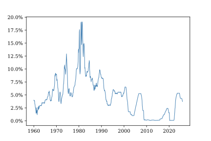
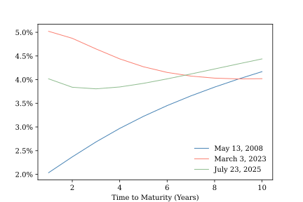
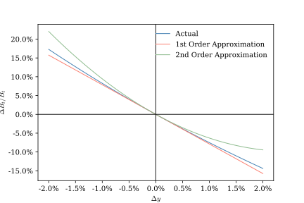

# Discounting Future Cash Flows

The Fundamental Theorem of Asset Pricing places discounted future payoffs at the center of asset valuation. In the previous chapter, and in many of the models to come, we assume that a risk-free asset grows at a constant, deterministic interest rate $r$.  This assumption simplifies the math of cash-flow discounting, enabling us to focus on other important model features.  But it not particularly realistic over anything but a very short time horizon.  @fig-effr shows the effective federal funds rate, an overnight interest rate managed by the Federal Reserve.  While it was low and stable for nearly a decade following the global financial crisis of 2008, it has fluctuated over a considerable range at other times.  In this chapter we show how future cash flows can be discounted when the instantaneous risk-free rate of return is a stochastic process that evolves over time.

{#fig-effr}

## Discounting cash flows with time-varying interest rates {#sec-discounting}

Given a constant risk-free interest rate $r$, the present value at time $t$ of a certain payout $X_T$ in the future is

$$
V_t = D_{t,T}\,X_T
$$
where the function $D_{t,T} = e^{-r(T-t)}$ is called the **discount factor**. This simple discounting formula, which we have already used repeatedly, is a direct consequence of the no arbitrage condition.  $V_0$ dollars invested at a constant, continuously-compounding interest rate evolves according to the geometric growth rule $V_t = e^{rt}$. In the absence of arbitrage, a guaranteed payment $X_T$ at time $T$ must be equal in value to an investment in the risk-free account that is allowed to grow until time $T$, so $V_0e^{rT}=X_T$.  A little division yields the discount formula.

When $X_T$ is uncertain, we can appeal to the FTAP to obtain

$$
V_t = \E_t^Q[D_{t,T}\,X_T] = D_{t,T}\E_t^Q[X_T].
$$

Now suppose the instantaneous rate of growth of money deposited in a risk-free account -- the **short rate** -- evolves over time according to the deterministic function $r_t$.  If our account contains $V_t$ at time $t$ then over a short interval we will receive $V_t r_t dt$ in interest.  If we invest $V_0$ dollars in the risk-free account and immediately reinvest all interest received so that it compounds, then the value in our account at time $T$ will be approximately equal to

$$
V_T \approx V_0\,\prod_{i=0}^{n-1} (1+r_{t_i}\Delta t),
$$
where $\Delta t = T/n$ and $t_i = i\Delta t$. Taking logs and using the first-order approximation of the natural logarithm produces

$$
\ln\left(\frac{V_T}{V_0}\right) \approx \sum_{i=0}^{n-1}\ln(1+r_{t_i}\Delta t) \approx \sum_{i=0}^{n-1}r_{t_i}\Delta t.
$$

The exact formula for $V_T$ is obtained by taking the limit

$$
\ln\left(\frac{V_T}{V_0}\right) = \lim_{n\to\infty}\sum_{i=0}^{n-1}r_{t_i}\Delta t = \int_0^Tr_t\,dt.
$$
So

$$
V_0 = D_{0,T}V_t
$$
where the discount factor from $t$ to $T$ is 

$$
D_{t,T} = e^{-\int_t^T r_s ds}.
$$  

We can use this generalization of the constant-rate discount factor we saw earlier to determine the present value of any certain future cash flows we like, provided we know the path of $r_t$. In particular

$$
V_t = D_{t,T}\E_t^Q[X_t].
$$

The discount factor has changed to reflect variation over time in the short rate, but the basic discounting approach is the same as before.

But what if we don't know the short-rate path in advance?  Then, of course, $\{r_t\}$ is a random process, and so is the discount factor $\{D_{t,T}\}$.  The pricing formula for an uncertain payout $X_T$ is

$$
V_t = \E_t^Q\left[D_{t,T}X_t\right].
$$

Thus, generalizing from a known, deterministic short rate $r$ to a stochastic short rate process $\{r_t\}$ requires two changes to our basic discounting approach.  First, we must use a discount factor that reflects the shape of the short-rate path from $t$ to $T$.  Second, and more substantively, the discount factor is itself a random process. We cannot take $D_{t,T}$ outside of the expectations operator.  

One implication of this is that the discounted value of a future payout $X_T$ is a random variable, even if $X_T$ is known in advance.  Even if one invests in very safe assets, such as U.S. Treasury securities, with certain future case flows, one still bares economic risk because of uncertainty about the future path of interest rates.

## Zero-coupon bonds and the term structure of interest rates {#sec-yield_curve}

Consider a risk-free, zero-coupon bond that provides a certain payment of exactly one dollar at date $T$. Its value at date $t$ is

$$
P_{t,T} = \E_t^Q[D_{t,T}].
$$
This trivial application of our risk-neutral discounting formula is tremendously useful.  If we observe the price of a risk-free, zero-coupon bond, we also observe the $Q$-measure expectation of the discount factor.  We don't need a model of the short-rate process to value a certain future payout at date $T$; all we need is the current price of a zero coupon bond that matures at $T$.  

More generally, for an uncertain payout, $X_T$,

$$
\begin{align*}
V_t =& \E_t^Q[D_{t,T} X_T] \\
=& \E_t^Q[D_{t,T}]\E_t^Q[X_T] + \Cov_t^Q[D_{t,T},X_T] \\
=& P_{t,T}\E_t^Q[X_T] +  \Cov_t^Q[D_{t,T},X_T].
\end{align*}
$$
If $X_T$ is uncorrelated under the $Q$ measure with the discount factor then we can value the claim by discounting its $Q$-measure expectation using a zero-coupon bond price.  If not, we need to account for the correlation between payouts and interest rates.

The valuation formula above conveys an important economic insight.  The random discount factor $D_{t,T}$ can be viewed as a kind of state-dependent exchange rate that converts future dollars into current dollars.  In future states of the world in which $D_{t,T}$ is high, we value wealth available at time $T$ relatively more highly than in states of the world in which $D_{t,T}$ is low.  An asset that pays a random amount $X_T$ at time $T$ will be more highly valued at time $t$ if it tends to pay more in those future states of the world in which wealth is particularly valuable.  All else equal, the asset will command a higher price today if its payoffs are positively correlated with the stochastic discount factor. Since the stochastic discount factor is negatively related to the realized path of interest rates, another way of saying this is that an asset with uncertain payouts will be relatively more valuable if its payouts are negatively correlated with future interest rates.

In applied work it is common to express the return on an asset in terms of an implied continuously compounding fixed interest rate, called the *yield*.  The **zero yield** $y$ on a zero-coupon bond is defined implicitly by the identity

$$
\frac{1}{P_{t,T}} = e^{y(t-T)}.
$$
Taking logs and rearranging terms produces the explicit expression

$$
y_{t,T} = - \frac{\ln(P_{t,T})}{T-t}.
$$
When you read about the *yield curve* in the financial press, you are reading about the relationship between time to maturity $(T-t)$ and the prices of risk-free bonds.^[Typically, published yields are computed from the traded prices of coupon-paying Treasury securities rather than directly from zero-coupon bond prices.]  As shown in @fig-yield_curve_ex, the yield curve may be upward- or downward-sloped or non-monotonic, depending on the $Q$-measure expected short-rate path at the time it is computed.

{#fig-yield_curve_ex}

Consider two alternative one-dollar investments made at time $t$. In the first case, we invest one dollar in a zero coupon bond maturing at date $T$ with price ($P_{t,T}$) and then immediately reinvest the proceeds in a new bond that matures at $T+\Delta T$ with a time-$T$ price of $F_{T,T+\Delta T}$.  In the second case, we invest one dollar directly in a bond that matures at $T+\Delta T$ whose price is $P_{t,T+\Delta T}$.  Because both investments have a value of one dollar today, and both investments are risk free, they must have the same value at $T+\Delta T$.  Thus

$$
P_{t,T}\,F_{T,T+\Delta T} = P_{t,T+\Delta T}.
$$
The formula for the zero yield implies

$$
\begin{align*}
y_{T,T+\Delta T} =& -\frac{ln(F_{T,T+\Delta T)}}{\Delta T} \\
=& -\frac{\ln(P_{t,T+\Delta T})-\ln(P_{t,T})}{\Delta T}.
\end{align*}
$$
This is the forward rate of interest for borrowing from $T$ to $T+\Delta$ implied by date-$t$ bond prices.  Taking the limit as $\Delta T \to 0$ gives us the time-$t$ **instantaneous forward rate**
$$
f_{t,T} = - \frac{\partial \ln(P_{t,T})}{\partial T}.
$$
$f_{t,T}$ is the market rate at date $t$ for guaranteed short-term funding at date $T$. In principle, one could lock in this rate using a long-short portfolio of risk-free bonds, though in practice this is more commonly done using interest rate futures.

Notice that
$$
y_{t,T} = \frac{1}{T-t}\int_t^T f_{t,s} ds
$$
so we can think of the zero yield as an average of instantaneous forward rates.

One might imagine that the instantaneous forward rate is simply the $Q$-measure expected short rate $\E_t^Q[r_T]$.  After all, they can both be interpreted as kinds of market-price-implied forecasts of future short-term interest rates.  In fact, while the two quantities are related, they are not the same. Through a series of straightforward substitutions one can show that

$$
f_{t,T} = \E_t^Q[r_T] + \frac{\Cov_t^Q[r_T,\,D_{t,T}]}{P_{t,T}}.
$$

Though the specific relationship is model dependent, future short rates and stochastic discount factors are usually negatively correlated, so typically $f_{t,T} > \E_t^Q[r_T]$.  The difference between the expected future short rate and the forward rate reflects the interaction between uncertainty about the path of future interest rates and the nonlinear relationship between interest rates and discount factors.^[Readers interested in exploring this relationship more deeply are encouraged to investigate the literature on "t-forward measures."  This literature shows that it is possible to reweight $Q$-measure probabilities by stochastic discount factors and thereby construct an alternative pricing measure under which forward rates are equal to expected short rates.] These interactions are also important for understanding how bond prices respond to changes in interest rates, the topic of the next section.

## Two views of duration and convexity

In trading and risk management applications it is often necessary to know how a bond's value will be affected by changes in the prevailing interest rate environment.  And, because one must often draw comparisons among many different bonds with different terms and payout structures, it is helpful to have common metrics with which to compare interest rate sensitivities. In this section we will take a closer look at the two most popular such metrics: Macaulay duration and convexity.

The first task in measuring a bond's sensitivity to changes in interest rates is to answer the question, "which interest rates?"  As we have just seen, a time-varying short-rate path implies an entire term structure of interest rates, and it is entirely possible that rates at different points on the term structure may move differently. In practice, duration and convexity are most commonly defined with respect to a parallel shift in the entire risk-free yield curve. If, at time $t$, the yield curve is perturbed by an amount $\Delta y$, then each discount factor $D_{t,T}$ is shifted to $D_{t,T}e^{-\Delta y(T-t)}$, so $\frac{\partial}{\partial y} D_{t,T} = -D_{t,T}(T-t)$.

If $B_t$ is the price of a bond at time $t$, the bond's **duration** is

$$
\mathcal{D} = -\frac{1}{B_t}\frac{\partial B_t}{\partial y}.
$$
Duration measures the percentage change in a bond's value for a small change in yield. By convention, duration is expressed as the negative of the semi-elasticity because bond prices decrease with future interest rates and it is convenient to work with positive numbers.  

**Convexity** is defined as 

$$
\mathcal{C} = \frac{1}{B_t}\frac{\partial^2 B_t}{(\partial y)^2}.
$$

Convexity measures the curvature of a bond’s price-yield relationship and captures the second-order effect of a small change in yield on the bond’s price.

Taken together, duration and convexity describe a second-order approximation of the percentage change in the bond price given a $\Delta y$ shift in the yield curve:

$$
\frac{\Delta B_t}{B_t} \approx -\mathcal{D}\Delta y + \frac12 \mathcal{D}(\Delta y)^2
$$

@fig-d_and_c shows an example of how a bond's price might change for a given parallel shift in the yield curve.  A second-order approximation of this change can be expected to perform better for small values of $\Delta y$ than a simple linear approximation that reflects only the effect of duration, but there is no guarantee that this will be true for larger yield curve shifts.

{#fig-d_and_c}

Suppose a bond pays a certain stream of future cash flows described by the function $c_t$ so that the amount it pays over a small interval of time is $c_t\,dt$.  Our standard valuation formula implies that its price at time $t$ is

$$
B_t = \E_t^Q\left[\int_t^TD_{t,s}\,c_s\,ds\right] = \int_t^T P_{t,s}\,c_s\,dt.
$$

The bond's duration is

$$
\mathcal{D} = \frac{1}{B_t}\int_t^T P_{t,s}\,(s-t)\,c_s\,ds = \int_t^T(s-t)\,w(s)\,ds
$$
and its convexity is

$$
\mathcal{C} = \frac{1}{B_t}\int_t^T P_{t,s}\,(s-t)^2\,c_s\,ds = \int_t^T(s-t)^2\,w(s)\,ds.
$$

where $w(s) = \frac{P_{t,s}c_s}{B_t}$.  

Notice that $\int_t^T w(s) ds = 1$ so we can think of $w(s)$ as a weighting function.  If we impose the assumption that $c_t \geq 0$ for all $t$, as is true for most bonds, then $w(s)ds$ is the share of the bond's current value contributed by cash flows that arrive in a short time interval near $s$. In fact, $w(s)$ is a valid probability density function, and bond duration and convexity can be interpreted as moments. 

$$
\mathcal{D} = \E^{w}[s-t]
$$

describes the present-value-weighted mean of cash flow arrival times.

$$
\mathcal{C} = \Var^{w}[s-t] + \mathcal{D}^2
$$
describes the dispersion of cash flow arrival times.

We can generalize the present value weighting measure $w(s)$ to include discrete payoffs as well.  When the cash flows are continuously distributed, this measure has a density $w(s)$. When the cash flows occur at discrete dates, it consists of point masses. In either case, it defines a probability distribution over the timing of a bond’s cash flows. So our interpretation of duration and convexity as moments can be applied to bonds with either continuous or discrete cash flows, or a mix of the two.

The moment interpretation of duration and convexity becomes a little more complicated when applied to assets like swaps or portfolios of long and short bond positions that have both positive and negative cash flows.  In this case we can separate $c_t$ into positive and negative cash flow components so that $c_t = c_t^+ - c_t^-$.  Each component can be viewed a separate positive cash flow asset with its own present value $B_t^\cdot$, duration $\mathcal{D}^\cdot$, and convexity $\mathcal{C}^\cdot$.  The duration of the net position is

$$
\mathcal{D} = \frac{B_t^+\mathcal{D}^+ - B_t^-\mathcal{D}^-}{B_t^+ - B_t^-}
$$
and its convexity is

$$
\mathcal{C} = \frac{B_t^+\mathcal{C}^+ - B_t^-\mathcal{C}^-}{B_t^+ - B_t^-}.
$$
The duration and convexity are moments of the positive and negative cash flow components weighted by each component's contribution to the present value of the net position.

## The economic difference between futures and forwards {#sec-f_and_f}
 
Futures and forwards are derivative contracts designed to allow market participants to lock in the price they will pay for an asset in the future, or to express a view on the change in the value of that asset over time.  Despite their similarity, the market structure for trading and clearing these contracts differ markedly.  Forward contracts are bespoke, bilateral arrangements between a pair of counterparties, while futures contracts are standardized, exchange traded, and centrally cleared.  Abstracting from these differences, forwards and futures also differ in terms of the timing of contract payment streams.  As we will show in this note, these timing difference mean that the economic interpretation of forwards and futures priced are not the same.

A forward contract is similar to a European call option except that there is no optionality.  At date $t$, the counterparty who is long the forward contract agrees to pay a fixed price $K_t$ at date $T$ in exchange for a specified quantity of an asset whose future value is $S_T$. In the absence of arbitrage, $K_t$ must be set so that the value of the forward contract is zero at date $t$ so that neither the buyer nor the seller can earn positive risk-free returns. Thus, using our standard $Q$-measure valuation formula,
 
$$
\begin{align*}
0 =& E_t^Q[D_{t,T}(S_T-K_t)] \\
K_t =& \frac{E_t^Q(D_{t,T}S_T)}{P_{t,T}} \\
K_t =& E_t^Q[S_T] + \frac{Cov_t^Q[D_{t,T}, S_t]}{P_{t,T}}.
\end{align*}
$$
 
The forward price is the $Q$-measure expectation of the asset value plus an adjustment term that reflects the extent to which the asset will tend to have higher value in states of the world where future wealth is more highly valued today.

The FTAP implies that if $S_t$ is an asset that generates no intermediate benefit flows (such as dividends) or cost flows (such as storage costs) then its discounted value is a martingale under the $Q$ measure. Substituting the martingale condition $S_t = \E_t^Q[D_{t,T}S_T]$ into the expression for $K_t$ gives us another way to interpret the forward price:

$$
K_t = \frac{S_t}{P_{t,T}}.
$$

Under no arbitrage, the forward price must reflect the opportunity cost (in terms of foregone risk-free interest income) of buying the asset at $t$ and holding it until $T$.

In a futures contract, market participants also transact at a price $F_t$ that ensures that the value of the contract at $t$ is zero.  However, rather than exchanging the full amount of the contract price at expiry, counterparties agree to mark the contract to market and exchange cash flows on an ongoing basis as gains and losses are realized.  If the contract rises in value, the seller pays the buyer the amount of this appreciation, and, likewise, if the contract falls in value the buyer makes a payment to the seller. These payments are called *variation margin*.  The cumulative net payments to the buyer over the life of the contract is
$$
\int_t^T dF_s = F_T-F_t.
$$
The present value of these payments depends on the times at which they are realized. Since the margin payments are computed to keep the value of the contract at zero over time, the futures price process $\{F_t\}$ must satisfy
$$
\E_t^Q\left[\int_t^T D_{t,s}dF_s\right] = 0
$$
for all values of $t$. An implication of this is that $\{F_t\}$ must have zero drift.  Otherwise someone could enter into the contract with a long or short position at no cost and instantly receive a positive $Q$-measure expected payment, which would violate the no arbitrage condition. Thus
$$
E_t^Q[dF_t]=0
$$ 
and $\{F_t\}$ is a martingale. At expiry the seller delivers the asset valued at $S_T$ to the buyer in exchange for the futures price, so $F_T=S_T$. Thus, it must be the case that
$$
F_t = E_t^Q[S_t].
$$
 
Comparing $K_t$ and $F_t$, we see that when the future path of interest rates is uncertain, forward and futures prices for delivery of the same asset at the same expiry date will differ from one another.  If the asset's future value is positively correlated with future interest rates, then a holder of a long futures position will tend to receive positive variation margin payments at times when the present value of those payments are relatively low and will need to make variation margin payments when their present values are relatively high.  This timing effect exactly offsets the correlation between asset values and discount rates embedded in the forward price.  Only when the asset's value is uncorrelated with interest rates can futures and forwards prices be expected to match.

## Taking stock and looking forward

In this chapter we have shown how time-varying short interest rates complicates the valuation of both known and unknown future cash flows.  This additional complexity brings with it new economic insights.  We have seen that when interest rates are uncertain, even assets with certain future cash flows entail risks because their present value may change over time as interest rates move.  This is not merely an academic risk mattering only to quant nerds; investors ignore it at their peril. For example, in 2023 Silicon Valley Bank famously failed, in part, because it lost money on "safe" U.S. Treasury securities whose market values were marked down when interest rates unexpectedly rose. 

The situation become even more nuanced when future payoffs are uncertain.  In this case an asset's current value depends not only on its risk neutral expected payout, but also on the correlation between future payouts and future interest rates.  Assets that generate higher payouts when interest rates are low command a premium relative to their risk-neutral expectations. This correlation effect can be undone by marking assets to market and transferring payments between buyers and sellers over time, as is done with futures contracts.  

Whether certain or uncertain, we cannot value future cash flows without knowing something about the time path of future interest rates.  In the next chapter we introduce two classic models of interest rates and show how they can be used to value bonds with certain cash flows.  In later chapters we will model uncertain cash flows and uncertain interest rates together.

