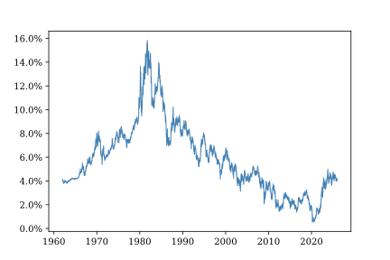
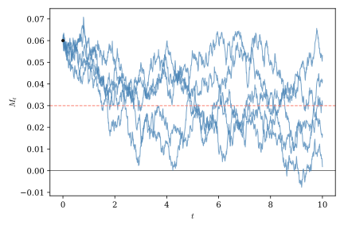
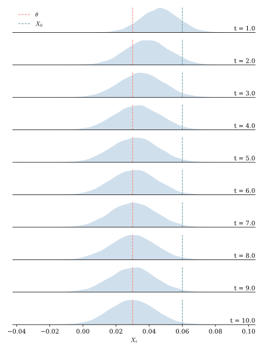
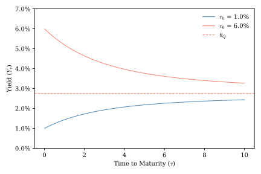
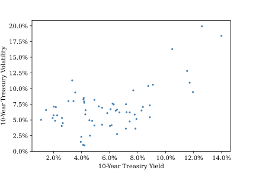
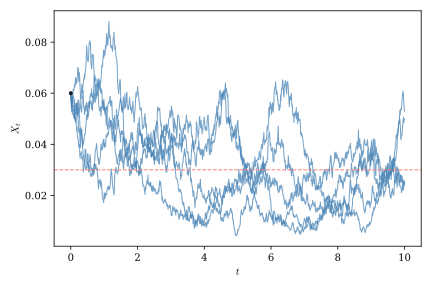
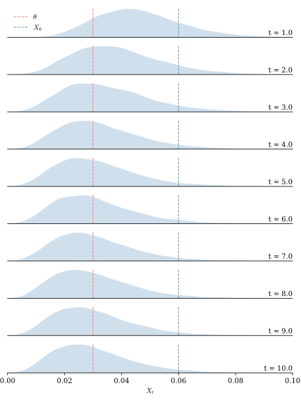
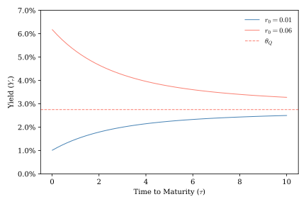
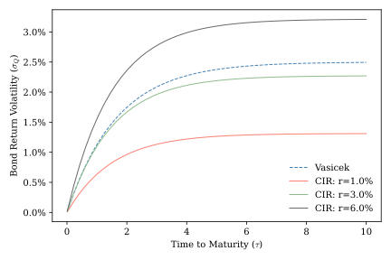

# Mean-Reverting Processes and Interest Rate Models {#sec-interest_rate_models}

Geometric Brownian Motion is a natural way to model a process that can grow without bound, such as the price of a stock, but in many settings negative feedback effects are likely to keep a process from moving too far away from a long-run equilibrium. For example, consider @fig-effr and @fig-ust_10_yr, which show short- and long-term U.S. interest rates over sixty years. Interest rates are rarely negative because households and businesses typically value current consumption more highly than future consumption. In those rare circumstances when interest rates drift into negative territory, monetary authorities are very likely to intervene, as negative interest rates can have adverse consequences for financial stability. Likewise, when interest rates become too high, monetary authorities face strong pressure to bring them down to avoid stifling economic growth. Processes that involve these kinds of stabilizing feedback effects are called *mean-reverting*. In this section we introduce two widely used mean-reverting stochastic processes and show how they can be used to model interest rates and price real bonds. Along the way, we will learn that risk premiums are not only relevant for pricing traded assets, but also for describing non-traded state variables.

{#fig-ust_10_yr}

## The Ornstein-Uhlenbeck process

The Ornstein-Uhlenbeck process is a mean-reverting stochastic process constructed from a Wiener process according to the following SDE:

$$
dX_t = \kappa (\theta - X_t) dt + \sigma dW_t.
$$

Notice that if $\kappa > 0$, $X_t$ will trend downward when $X_t > \theta$ and upward when $X_t < \theta$, so $X_t$ will move toward $\theta$ over time. $\theta$ captures the long-run equilibrium value of $X_t$, $\kappa$ describes the speed with which $X_t$ moves toward this equilibrium, and $\sigma$ captures the magnitude of shocks that may move $X_t$ away from equilibrium.

From this SDE we can derive the distribution of $X_t$ at any time $t$. To do so, we will use an integrating factor. The following simple application of the standard chain rule

$$
\begin{align*}
\diff{x_t\,e^{k t}}{t} &= \diff{dx_t}{dt} e^{k t} + k x_t e^{k t} \\
d \left(x_t e^{k t}\right) &= e^{k t} d x_t + k x_t e^{k t} dt.
\end{align*}
$$

suggests that the integrating factor $e^{k t}$ can help us simplify the SDE. Using this factor we can rewrite the SDE as follows:

$$
\begin{align*}
dX_t &= \kappa\,(\theta - X_t)\,dt + \sigma\,dW_t \\
dX_t + \kappa\,X_t\,dt &= \kappa\,\theta\,dt + \sigma\,dW_t \\
e^{\kappa t}\,dX_t + e^{\kappa t}\,\kappa\,X_t\,dt &= e^{\kappa t}\,\kappa\,\theta\,dt + e^{\kappa t}\,\sigma\,dW_t \\
d \left(X_t\,e^{\kappa t}\right) &= e^{\kappa t}\,\kappa\,\theta\,dt + e^{\kappa t}\,\sigma\,dW_t.
\end{align*}
$$ 

Now that we've brought $r_t\,e^{\kappa t}$ to the left-hand side, we can integrate both sides of the equation to obtain 

$$
\begin{align*}
\int_0^t d \left(X_s e^{\kappa s}\right) &= \int_0^t e^{\kappa s}\,\kappa\,\theta\,ds + \int_0^t e^{\kappa s}\,\sigma\,dW_s \\
X_t\,e^{\kappa t} - X_0 &= \theta \,\left(e^{\kappa t} - 1\right) + \sigma\,\int_0^t e^{\kappa s}\,dW_s \\
X_t &= X_0\,e^{-\kappa t} + \theta\,\left(1-e^{-\kappa t}\right) + e^{-\kappa t}\,\sigma\,\int_0^t e^{\kappa s}\,dW_s \\
X_t &= \theta + e^{-\kappa t}\,\left(X_0 - \theta\right)  + e^{-\kappa t}\,\sigma\,\int_0^t e^{\kappa s}\,dW_s. 
\end{align*}
$$

Looking at the right-hand expression of the final line, note that $\int_0^t e^{\kappa s}\,dW_s$ is an Itô integral with a deterministic integrand. Applying what we've learned about Ito Integrals, we have

$$
\int_0^t e^{\kappa s} dW_s \sim N\left(0,\:\int_0^t \left(e^{\kappa s}\right)^2 ds\right) = N\left(0,\:\frac{e^{2\,\kappa\,t}-1}{2\kappa}\right).
$$

Since all other terms in the right-hand expression of the integrated SDE are constants, we can conclude that

$$
X_t\,|\,X_0 \sim N\left(\theta + e^{-\kappa t}\left(X_0 - \theta\right),\:\sigma^2\,\frac{1-e^{-2\,\kappa\,t}}{2\kappa}\right).
$$

The long-run steady-state distribution of $r_t$ is

$$
\lim_{t\to\infty} X_t\,|\,X_0 \sim N\left(\theta,\:\frac{\sigma^2}{2\kappa}\right).
$$

The definition below summarizes the key properties of the Ornstein-Uhlenbeck process we've just derived for future reference.

::: {.callout-tip title="Ornstein-Uhlenbeck Process"}

An **Ornstein--Uhlenbeck (OU) process** is a continuous-time stochastic process that evolves according to the stochastic differential equation

$$
dX_t = \kappa(\theta - X_t)\,dt + \sigma\,dW_t,
$$

where

-   $\theta$ is the long-run mean of the process,
-   $\kappa > 0$ is the speed of mean reversion,
-   $\sigma > 0$ is the diffusion coefficient, and
-   $W_t$ is a Wiener process.

The Ornstein--Uhlenbeck process has the following conditional distribution:

$$
X_t \mid X_s
\sim
N\!\left(
X_s e^{-\kappa (t-s)}
+
\theta\left(1-e^{-\kappa (t-s)}\right),
\;
\frac{\sigma^2}{2\kappa}
\left(1-e^{-2\kappa (t-s)}\right)
\right),
\qquad t>s.
$$

As the time horizon becomes large, the effects of the initial condition gradually disappear and the process converges to its stationary distribution,

$$
X_t
\sim
N\!\left(
\theta,
\frac{\sigma^2}{2\kappa}
\right).
$$
:::

As show in @fig-OU_paths and @fig-OU_dist, even when the O-U process starts far from its long-run mean, it tends to shift toward that level over time. The variance of the long-run distribution reflects a balancing between the stabilizing effect of mean reversion and the destabilizing effect of random shocks. The stronger the mean-reversion parameter, $\kappa$, the more tightly the process is centered around its long-run mean, $\theta$. The larger the diffusion parameter $\sigma$, the more widely the process fluctuates around this mean.

{#fig-OU_paths}

{#fig-OU_dist}

The Ornstein–Uhlenbeck process provides the mathematical foundation for several important financial models. In the next section we will examine a classic model that makes use of an Ornstein–Uhlenbeck process to describe short-term interest rates.

## Vasicek's model and the valuation of real bonds {#sec-vasicek}

As discussed in the previous chapter, in continuous-time finance the short rate is the instantaneous interest rate at which an investor can borrow or lend money without risk. The short rate is a non-traded state variable that is not directly observable in the market, though in practice it is well proxied by very short-term overnight risk-free rates such as the effective federal funds rate or the secured overnight financing rate (SOFR). @vasicek1977equilibrium models the short rate $r_t$ as a mean-reverting Ornstein-Uhlenbeck process under the physical measure:

$$
dr_t = \kappa\,(\theta_P - r_t)\,dt + \sigma\,dW_t^P.
$$

To model the short rate process under the $Q$-measure, we assume a constant risk premium parameter, $\lambda$, and use the Girsanov result

$$
dW_t^Q = dW_t^P + \lambda\,dt.
$$

We can then rewrite the SDE as follows:

$$
\begin{align*}
dr_t &= \kappa\,(\theta_P - r_t)\,dt + \sigma\,dW_t^P \\
&= \kappa\,(\theta_P - r_t)\,dt + \sigma\,\left(dW_t^Q - \lambda\,dt\right) \\
&= \kappa\,(\theta_Q - r_t)\,dt + \sigma\,dW_t^Q
\end{align*}
$$

where

$$
\theta_Q = \theta_P - \frac{\sigma}{\kappa}\lambda.
$$

Notice that under this change of measure the long-run equilibrium interest rate shifts but the mean-reversion and volatility parameters remain the same. We can use what we already know about the O-U process to describe the short rate process under the $Q$-measure; all we have to do is change the value of $\theta$.

At this point you may be wondering about the Fundamental Theorem of Asset Pricing and whether it allows us to say more about $\theta_Q$. After all, in our earlier discussion of risk-neutral asset valuation we saw that the FTAP implies that the expected rate of return on traded assets under the $Q$-measure must equal the risk-free rate. Importantly, the short rate is not a traded asset and so its change over time is not directly constrained by the FTAP.

So if the short rate is a non-traded asset, what is it good for? While the FTAP does not allow us to pin down the risk premium associated with non-traded state variables like the short rate, it can be used to value other assets that depend on those variables. In particular, as we saw in the last chapter, we can use the short rate to value real bonds that pay a known payment with certainty at maturity.

Consider again a risk-free, zero-coupon bond that pays \$1 at date $T$. To trim notation a bit, we will only derive the value of a bond at date $t=0$. Once we've done this, the generalization to arbitrary values of $t$ should be obvious. Recall from @sec-yield_curve that the bond's value is given by
$$
P_{0,T}=\E_0^Q\left[e^{-\int_0^T r_s\,ds}\right].
$$

Our analysis of the O-U process has established that $r_t$ is normally distributed. Since $\int_0^\tau r_s ds$ is simply the limit of a sum of normal random variables, it also has a normal distribution. We can write

$$
r_s = \theta + e^{-\kappa\,s}\,\left(r_0 - \theta\right)  + e^{-\kappa\,s}\,\sigma\,\int_0^s e^{\kappa\,u}\,dW_u.
$$

Integrating $r_s$ yields

$$
\begin{align*}
\int_0^T r_s\,ds &= \int_0^T\left(\theta + e^{-\kappa\,s}\,\left(r_0 - \theta\right)  + e^{-\kappa\,s}\,\sigma\,\int_0^s e^{\kappa\,u}\,dW_u\right)ds \\
&= \int_0^T\left(\theta + e^{-\kappa\,s}\,\left(r_0 - \theta\right)\right) ds  + \int_0^T e^{-\kappa\,s}\,\sigma\,\int_0^s e^{\kappa\,u}\,dW_u ds \\
&= \theta\,T + \frac{r_0 - \theta}{\kappa}\left(1-e^{-\kappa\,T}\right)
+ \sigma\,\int_0^T \int_0^s e^{-\kappa\,(s-u)}\,dW_u\,ds \\
&= \theta\,T + \frac{r_0 - \theta}{\kappa}\left(1-e^{-\kappa\,T}\right)
+ \sigma \int_0^T\,\int_u^T e^{-\kappa\,(s-u)}\,ds\,dW_u \\
&= \theta\,T + \frac{r_0 - \theta}{\kappa}\left(1-e^{-\kappa\,T}\right)
+ \frac{\sigma}{\kappa} \int_0^T \left(1-e^{-\kappa\,(T-u)}\right)\,dW_u
\end{align*}
$$

Looking at the last expression, we have a constant part plus an Itô integral of a deterministic function. Hence we know that

$$
\int_0^T r_s\,ds \sim N(m,v)
$$

where

$$
m = \theta\,T + \frac{r_0 - \theta}{\kappa}\left(1-e^{-\kappa\,T}\right)
$$

and

$$
\begin{align*}
v &= \frac{\sigma^2}{\kappa^2} \int_0^T \left(1-e^{-\kappa\,(T-u)}\right)^2 du \\
&= \frac{\sigma^2}{\kappa^2} \int_0^T \left(1-2e^{-\kappa\,(T-u)} + e^{-2\kappa\,(T-u)}\right) du \\
&= \frac{\sigma^2}{\kappa^2} \left( 
    T - \frac{2}{\kappa}\left(1-e^{-\kappa\,T}\right) + \frac{1}{2\kappa} \left(1-e^{-2\kappa\,T}\right)
\right).
\end{align*}
$$

Now @thm-normal-exp-moment implies that

$$
P_{0,T} = e^{-m_Q + \frac{1}{2}v}.
$$

A little additional algebra produces the canonical form of the Vasicek affine term structure bond pricing equation.

$$
P_{t,T} = \exp(\mathcal{A}(t,T)-\mathcal{B}(t,T)\,r_t),
$$

where

$$
\mathcal{B}(t,T) = \frac{1-e^{-\kappa\,\tau}}{\kappa},
$$

$$
\mathcal{A}(t,T) = \left(\theta_Q-\frac{\sigma^2}{2\kappa^2}\right)
\left(\mathcal{B}(t,T)-\tau\right)-\frac{\sigma^2}{4\kappa}\mathcal{B}(t,T)^2,
$$

and $\tau = T-t$.

The functions $\mathcal{A}(t,T)$ and $\mathcal{B}(t,T)$ depend only on the model parameters and the time remaining to maturity, while all dependence on the current state of the economy enters through the current short rate $r_0$. $\mathcal{B}(t,T)$ measures the bond price's sensitivity to the current short rate and can be viewed as a measure of duration. $\mathcal{A}(t,T)$ accounts for the expected future path and uncertainty of future short rates. The Vasicek model is a member of broader class of **affine term structure models** in which the logarithm of the bond price can be expressed as a linear function of the short rate. We will see another example of such a model later in this chapter.

The Vasicek model captures important features of the real-world bond market. By describing the short rate as a mean-reverting process it can produce both upward and downward sloping yield curves, depending on the relationship between the current short rate and the $Q$-measure long-run equilibrium short rate $\theta_Q$. For most values of $r_0$ the yield curve shifts monotonically from the current short rate towards the $Q$-measure equilibrium short rate plus a convexity adjustment that reflects the nonlinear relationship between bond prices and yields. When $r_0$ is close to $\theta_Q$ the yield curve may be non-monotonic, but for plausible values of $\kappa$ and $\sigma$ this range of values is quite small. @fig-Vasicek_term_structure shows the yield curves implied by the Vasicek model for different values of the initial short rate, $r_0$. When $r_0 < \theta_Q$, the yield curve is upward sloping, reflecting the expectation that interest rates will rise over time. When $r_0 > \theta_Q$, the yield curve is downward sloping.

{#fig-Vasicek_term_structure}

We can gain insights into the Vasicek model's predictions for bond price dynamics by differentiating $P_{t,T}$ using Ito's Lemma.

$$
\begin{align*}
dP =& \pd{P}{t}\,dt + \pd{P}{r}\,dr_t + \frac12\pdd{P}{r}\,(dr)^2 \\
dP =& P\,(\mathcal{A}_t-\mathcal{B}_t\,r)\,dt - P\,\mathcal{B}\,dr + \frac12 P\,\mathcal{B}^2\,(dr)^2 \\
\frac{dP}{P} =& (\mathcal{A}_t-\mathcal{B}_t\,r)\,dt - \mathcal{B}\,dr + \frac12 \mathcal{B}^2\,(dr)^2 
\end{align*}
$$

where $\mathcal{A}_t$ and $\mathcal{B}_t$ are derivatives of $\mathcal{A}(t,T)$ and $\mathcal{B}(t,T)$ with respect to $t$. Under the physical measure

$$
dr = \kappa\,\left(\theta_P-r\right)\,dt + \sigma\,dW^P
$$

and

$$
(dr)^2 = \sigma^2\,dt.
$$

Substitution yields

$$
\begin{align*}
\frac{dP}{P} =& (\mathcal{A}_t-\mathcal{B}_t\,r)\,dt - \mathcal{B}\,dr + \frac12 \mathcal{B}^2\,(dr)^2 \\
=& (\mathcal{A}_t-\mathcal{B}_t\,r)\,dt - \mathcal{B}\,(\kappa\,\left(\theta_P-r\right)\,dt + \sigma\,dW^P) + \frac12 \mathcal{B}^2\,\sigma^2\,dt \\
=& \mu_P^\text{Bond}\,dt + \sigma^\text{Bond}\,dW^P,
\end{align*}
$$

where

$$
\mu_P^\text{Bond} = \mathcal{A}_t - \mathcal{B}_t\,r - \kappa\,\mathcal{B}\,(\theta_P - r) + \frac12 \mathcal{B}^2\sigma^2
$$

is the drift and

$$
\sigma^\text{Bond} = \sigma\,\mathcal{B}
$$

is the volatility of the bond's instantaneous return under the physical measure. Thus we have shown that the bond return follows an Ito process!

Under the Vasicek model the drift in bond returns under the physical measure depends on both the level of the current spot rate and its difference from its long-run mean. This contrasts sharply with the assumptions of the geometric Brownian motion model used to describe equity returns, which assumes a constant drift. Since $\mathcal{B}(t,T)$ is an increasing function time-to-maturity, the model predicts that, all else equal, longer maturity bonds will exhibit higher volatility. This makes sense, as longer maturity bonds are exposed to greater uncertainty about future short interest rates.

The fact that the short rate follows an O-U process under both the physical and the risk-neutral measure makes the Vasicek model particularly well suited to exploring the effects of investor preferences on the term structure of interest rates. The relationship between the long-run equilibrium short rate under the physical measure, $\theta_P$, and under the risk-neutral measure, $\theta_Q$, is a direct reflection of the risk premium parameter, $\lambda$, which captures investor preferences.

In general $\lambda$ may either be positive or negative, depending on the risk preferences of investors in the market. A positive value of $\lambda$ implies that $\theta_Q < \theta_P$, meaning that investors price bonds "as if" future interest rates will be lower than they actually expect them to be. Lower interest rates imply higher bond prices, which means that investors are willing to pay more for bonds today, all else equal, when $\lambda$ is positive. This is consistent with the idea that bonds tend to be viewed as a hedge against adverse economic conditions. Risk averse investors are willing to pay a premium for them, accepting a lower expected return in exchange for the protection they provide. The opposite situation arises when $\lambda < 0$, as could occur if inflation were a significant concern. In this case bond investors price bonds "as if" future spot interest rates will be higher than expected and bond prices are correspondingly lower.

The bond return drift under the risk neutral measure, $\mu_Q^\text{Bond}$, can be derived using the same steps we used to derive $\mu_P^\text{Bond}$. The difference between the physical and risk neutral drifts is

$$
\mu_P^\text{Bond} - \mu_Q^\text{Bond} = \kappa\,\mathcal{B}\,(\theta_Q - \theta_P) = -\kappa\,\mathcal{B}\,\left(\frac{\sigma}{\kappa}\lambda\right) = -\mathcal{B}\,\sigma\,\lambda.
$$

The bond is a traded asset, so the FTAP implies that $\mu_Q^\text{Bond} = r$ at every point in time. Thus

$$
\mu_P^\text{Bond} - r = - \mathcal{B}\,\sigma\,\lambda.
$$

The bond's instantaneous excess return over the risk-free short rate at any point in time is proportional to its exposure to interest rate risk. When $\lambda$ is positive the excess return is negative, consistent with the idea that investors might be willing to "overpay" for bonds that are viewed as a hedge against macroeconomic risk. When $\lambda <0$ investors must receive a premium in excess of the risk-free rate to accept the interest rate risk associated with holding long-term bonds. For a given value of $\lambda$, the magnitude of a bond's excess return increases with its duration. Since bonds are tradable and we have only introduced one source of uncertainty, the market is complete. In principle we could infer $\lambda$ from the term structure of bond prices or yields.

## The Cox-Ingersoll-Ross Process

A consequence of the Vasicek model's constant short-rate volatility assumption is that the volatility of bond returns is also constant. However, as shown in @fig-bond_vol bond return volatility tends to be higher during periods of high interest rates. The model of @cox1985cir preserves much of the structure of the Vasicek model but allows the short rate volatility to grow in proportion to the short rate itself. Not only does this allow for a more accurate description of bond volatility, it also ensures, realistically, that the modeled short rate will not become negative.

{#fig-bond_vol}

The CIR process used to model the short rate is described by the SDE

$$
d X_t = \kappa\,\left(\theta - X_t\right)\,dt + \sigma \sqrt{X_t}\,dW_t.
$$

Note the similarity between the CIR process and the O-U process. Both are mean reverting with parameters $\theta$ and $\kappa$ determining the speed of convergence and the long-run equilibrium. The only difference is the appearance of $\sqrt{X_t}$ in the dispersion term, which causes the volatility of the process to grow in proportion to its level. If $2\kappa\theta > \sigma^2$ the CIR process almost surely never hits zero.

Unfortunately, the presence of the $\sqrt{X_t}$ term in the CIR process prevents us from using an integrating factor to solve for the distribution of $X_t$, as we did with the O-U process. Nonetheless the SDE embeds useful information about the moments of the process.

Taking expectations of both sides of the SDE produces

$$
\begin{align*}
\E[d X_t] &= E\left[\kappa\,\left(\theta - X_t\right)\,dt + \sigma\,\sqrt{X_t}\,dW_t\right] \\
d \E[X_t] &= \kappa\,\left(\theta - E[X_t]\right)\,dt + \sigma\,\E\left[\sqrt{X_t}\,dW_t\right] \\
d \E[X_t] &= \kappa\,\left(\theta - E[X_t]\right)dt \\
d \E[X_t] + \kappa\,\E[X_t]\,dt &= \kappa\,\theta\,dt.
\end{align*}
$$

The final expression is an ODE that can be solved using an integrating factor:

$$
\begin{align*}
e^{\kappa t}\,d\E[X_t] + e^{\kappa t}\,\kappa\,\E[X_t] dt &= e^{\kappa t}\,\kappa\,\theta\,dt \\
d\left(e^{\kappa t}\,\E[X_t]\right) &= e^{\kappa t}\, \kappa\,\theta\,dt \\
\int_0^t d\left(e^{\kappa s} \E[X_s]\right) &= \int_0^t e^{\kappa s} \kappa\theta ds \\
e^{\kappa t}\,\E[X_t] - \E[X_0] &= \theta\,\left(e^{\kappa t}-1\right) \\
\E[X_t] &= X_0\,e^{-\kappa t} + \theta\,\left(1-e^{-\kappa t}\right) 
\end{align*}
$$

Thus, just as with the O-U process, the expectation of $X_t$ shifts from $X_0$ toward $\theta$ over time.

To compute the variance of $X_t$ we make use of Itô's Lemma:

$$
\begin{align*}
d(X_t^2) &= \pd{X_t^2}{t}\,dt + \pd{X_t^2}{X}\,dX + \frac12\pdd{X_t^2}{X_t}\,(d X_t)^2 \\
 &= 2\,X_t\,dX_t + (d X_t)^2 \\
 &= 2\,X_t\,(\kappa\,\left(\theta - X_t\right)\,dt + \sigma\,\sqrt{X_t}\,dW_t) + (\kappa\,\left(\theta - X_t\right)\,dt + \sigma\,\sqrt{X_t}\,dW_t)^2 \\
 &= 2\,X_t\,(\kappa\,\left(\theta - X_t\right)\,dt + \sigma\,\sqrt{X_t}\,dW_t) + \sigma^2\,X_t\,dt.
\end{align*}
$$

Taking the expectation of both sides of the equation produces

$$
\begin{align*}
\E[d(X_t^2)] &= \E\left[2\,X_t\,(\kappa\,\left(\theta - X_t\right)\,dt + \sigma\,\sqrt{X_t}\,dW_t) + \sigma^2\,X_t\,dt\right] \\
d \E[X_t^2] &= 2\,\E\left[X_t \kappa\,\left(\theta - X_t\right)\right]\,dt + 2\,\sigma\,\E[X_t\,\sqrt{X_t}\,dW_t] + \sigma^2\,\E[X_t]\,dt \\
d \E[X_t^2] &= 2\,\E\left[X_t\,\kappa\,\left(\theta - X_t\right)\right]\,dt + \sigma^2\,\E[X_t]\,dt \\
d \E[X_t^2] &= 2\,\kappa\,\theta\,\E[X_t]\,dt - 2\,\kappa\,\E[X_t^2]\,dt + \sigma^2\,\E[X_t]\,dt \\
\frac{d\E[X_t^2]}{dt} &= (2\,\kappa + \sigma^2)\,\E[X_t] - 2 \kappa\,\E[X_t^2]
\end{align*}
$$

Once again we have a simple ODE which can be solved using an integration factor to obtain

$$
\E[X_t^2]=\left(\theta+(X_0-\theta)\,e^{-\kappa t}\right)^2 +
\frac{\sigma^2}{\kappa}X_0\,e^{-\kappa t}
\left(1-e^{-\kappa t}\right) + \frac{\theta\,\sigma^2}{2\,\kappa}
\left( 1- e^{-\kappa t}\right)^2.
$$

Using our results for $\E[X_t]$ and $\E[X_t^2]$ we can compute the variance of $X_t$. A bit of algebra produces

$$
\operatorname{Var}(X_t) =
\frac{\sigma^2}{\kappa}r_0\,e^{-\kappa t}
\left(1-e^{-\kappa t}\right) +
\frac{\theta\,\sigma^2}{2\,\kappa}
\left(1-e^{-\kappa t}\right)^2.
$$

Unlike the GBM and O-U processes, the CIR process does not admit a simple closed-form pathwise solution. Nevertheless, its transition distribution is known exactly. Standard derivations for the distribution of $X_t | X_0$ rely on solving the Kolmogorov (Fokker--Planck) forward equation or by transforming the CIR process into a squared Bessel process. Both of these approaches are beyond the scope of this text, so we simply state the result below.

::: {.callout-tip title="Cox--Ingersoll--Ross Process"}
The **Cox--Ingersoll--Ross (CIR) process** is a continuous-time stochastic process defined by the stochastic differential equation

$$
dX_t
=
\kappa(\theta-X_t)\,dt
+
\sigma\sqrt{X_t}\,dW_t,
$$

where

-   $X_t$ is the value of the process at time $t$,
-   $\kappa>0$ is the speed of mean reversion,
-   $\theta>0$ is the long-run mean,
-   $\sigma>0$ is the volatility parameter, and
-   $W_t$ is a standard Wiener process.

The conditional mean and variance are

$$
\E[X_t \mid X_0]
=
\theta
+
(X_0-\theta)e^{-\kappa t},
$$

and

$$
\operatorname{Var}(X_t \mid X_0)
=
\frac{\sigma^2}{\kappa}
X_0\,
e^{-\kappa t}
\left(1-e^{-\kappa t}\right)
+
\frac{\theta\sigma^2}{2\kappa}
\left(1-e^{-\kappa t}\right)^2.
$$

The transition distribution of the process is

$$
X_t
=
cY,
$$

where

$$
Y
\sim
\chi'^2_d(\xi)
$$

is a non-central chi-squared random variable with

$$
c
=
\frac{\sigma^2\left(1-e^{-\kappa t}\right)}
{4\kappa},
$$

degrees of freedom

$$
d
=
\frac{4\kappa\theta}{\sigma^2},
$$

and non-centrality parameter

$$
\xi 
=
\frac{4\kappa e^{-\kappa t}}
{\sigma^2\left(1-e^{-\kappa t}\right)}
\,r_0.
$$

When the **Feller condition**

$$
2\kappa\theta
\ge
\sigma^2
$$

is satisfied, the process remains strictly positive with probability one. Otherwise, the process may reach zero, although it remains non-negative.
:::

Comparing @fig-OU_paths and @fig-cir_paths, the most obvious differences from the O-U process is that CIR paths never cross the x axis and tend to fluctuate more when they are farther from the axis. Similar to the O-U process, the CIR process shifts toward a steady state distribution centered on $\theta$ over time, but the steady state distribution is right skewed because it is bounded below by zero.

{#fig-cir_paths}

{#fig-cir_dist}

## Bond pricing under the CIR model

Under the Cox-Ingersoll-Ross model, the short rate, $r_t$, follows a CIR process. This is a bit more realistic than the Vasicek model because the short rate remains strictly positive and its volatility increases in proportional to its level. This improvement notwithstanding, the CIR model exhibits many of the same features as the Vasicek model. It produces an affine bond pricing formula that can generate both upward and downward sloping yield curves, and investor preferences affect the shape of the yield curve in a similar way. The CIR model's main technical innovation is that it embeds state-dependent volatility. Since volatility depends on $r_t$ we can think of it as being sensitive to the state of the economy. This is the first model we have encountered with state-dependent volatility. It will not be the last.

As with the Vasicek model, the CIR model can be used to value real bonds. We begin by relating the P-measure and Q-measure processes. Similar to previous examples, our objective is to find a risk-neutral measure that preserves the main features of he CIR model so we can leverage the results we have already derived. Then we will derive a pricing equation that satisfied the martingale property.

In the simple Vasicek model we assumed a constant risk premium, $\lambda$. For the CIR model, we instead choose a risk premium that depends on the state variable $r_t$. Specifically let

$$
\lambda(r) = \lambda\sqrt{r}.
$$

The Girsanov's theorem implies that

$$
dW_t^P = dW_t^Q - \lambda\sqrt{r_t}dt
$$

so

$$
\begin{align*}
d r_t &= \kappa_P \left(\theta_P - r_t\right)dt + \sigma \sqrt{r_t}dW_t^P \\
&= \kappa_P \left(\theta_P - r_t\right)dt + \sigma \sqrt{r_t}[dW_t^Q - \lambda\sqrt{r_t}dt] \\
&= \kappa_P\theta_P dt - \kappa_P r_t dt - \sigma\lambda r_t dt + \sigma \sqrt{r_t}dW_t^Q \\
&= (\kappa_P+\sigma\lambda)\left(\theta_P\left(1-\frac{\lambda\sigma}{\kappa_P + \sigma\lambda}\right)-r_t\right)dt + \sigma \sqrt{r_t}dW_t^Q\\
&= \kappa_Q(\theta_Q -r_t )dt + \sigma \sqrt{r_t}dW_t^Q 
\end{align*}
$$

where

$$
\kappa_Q = \kappa_P + \sigma\lambda
$$

and

$$
\theta_Q = \theta_P\frac{\kappa_P}{\kappa_P + \sigma\lambda}. 
$$

The change of measure affects the drift component of the SDE but not the volatility component and preserves the model's CIR process structure.

The Q-measure pricing expectation under the CIR model is identical to that under the Vasicek model. As before, to keep our notation from getting too cluttered, we will omit labels for Q-measure parameters (recognizing that we will use the Q measure throughout the derivation) and we will frequently use the symbol $\tau$ as a shorter way of denoting the remaining time to maturity, $T-t$.  Once again, the price of a zero-coupon bond is

$$
P_{t,T}=\E_t\left[e^{-\int_t^T r_s\,ds} \right].
$$

Unfortunately we can not solve this expectation directly by integration, as we did with the Vasicek model. Instead we proceed by assuming that the price has the same basic affine structure as with the Vasicek model. We then apply Itô's Lemma to pin down specific properties of the equation. This strategy might seem a bit like magic, as we have introduced no clear reason for the assumed an affine structure beyond appealing to the general similarities between the Vasicek and CIR models. While there do exist theorems describing the general class of models that have this structure, a more practical way to reconcile ourselves with this approach is to simply recognize that it is similar to the strategy used to solve broad classes of ordinary differential equations. Essentially, we assume an answer and then test whether it works.

We assume

$$
P_{t,T} = e^{\mathcal{A}(t,T)-\mathcal{B}(t,T)\,r_t}.
$$ 

As a notations convenience, we will write $\mathcal{A}(t)$ and $\mathcal{B}(t)$ for the two affine pricing terms since $T$ remains constant in the derivation that follows.

Using Ito's Lemma to differentiate the valuation function with respect to $t$ produces

$$
\begin{align*}
dP_{t,T} =& \left(\mathcal{A}'(t)\,P_{t,T} - r_t\,\mathcal{B}'(t)\,P_{t,T}\right)\,dt \\
& + \left(-\mathcal{B}(t)\,P_{t,T}\right)\,dr_t \\
& + \frac12 \left(\mathcal{B}(t)^2\,P_{t,T}\right)\,(dr_t)^2 \\
\frac{dP_{t,T}}{P_{t,T}} =&
\left(\mathcal{A}'(t) - r_t\,\mathcal{B}'(t)\right)\,dt 
 -\mathcal{B}(t)\,dr_t 
+ \frac12 \mathcal{B}(t)^2\,(dr_t)^2. \\
\end{align*}
$$

The Ito differential rules imply that $(dr_t)^2 = r_t\,\sigma^2\,dt$. Substituting $dr_t$ and $(dr_t)^2$ out of the above equation and rearranging terms gives us

$$
\begin{align*}
\frac{dP_{t,T}}{P_{t,T}} =&
\left(\mathcal{A}'(t) - r_t\,\mathcal{B}'(t)\right)\,dt \\
& - \mathcal{B}(t)\,\left(\kappa(\theta -r_t)\,dt + \sigma \sqrt{r_t}dW_t\right) \\
& + \frac12 \mathcal{B}(t)^2\,r_t\,\sigma^2\,dt \\
=& \left[ \mathcal{A}'(t) - r_t\,\mathcal{B}'(t) - \mathcal{B}(t)\,\kappa\,(\theta-r_t) + \frac12 \mathcal{B}(t)^2\,r_t\,\sigma^2\right]\,dt \\
& - \mathcal{B}(t)\,\sigma\,\sqrt{r_t}\,dW_t.
\end{align*}
$$

Notice that the growth process for the bond value is an Ito process whose drift is equal to the expression in square brackets. Collecting terms in the drift expression on $r_t$ helps to clarify what is going on:

$$
\underbrace{\left[\mathcal{A}'(t)-\mathcal{B}(t)\,\kappa\,\theta\right]}_\text{intercept} 
+ \underbrace{\left[-\mathcal{B}'(t)+\mathcal{B}(t)\,\kappa + \frac12 \mathcal{B}(t)^2\,\sigma^2\right]}_\text{slope}\,r_t.
$$

At any given point in time, $t$, the drift in the bond value growth rate is a linear function of $r_t$. The FTAP tells us that under the Q measure this drift must be equal to $r_t$. This condition can only be satisfied for all values of $t$ if the intercept is equal to zero and the slope is equal to one. Thus, the FTAP implies the following system of differential equation:

$$
\begin{align*}
\mathcal{A}'(t) - \mathcal{B}(t)\,\kappa\,\theta &= 0 \\
-\mathcal{B}'(t) + \mathcal{B}(t)\,\kappa + \frac12 B(t)^2\,\sigma^2 &= 1
\end{align*}
$$

Boundary conditions for these equations arise from the fact that at maturity $P_{T,T} = 1$, implying that $\mathcal{A}(T)=0$ and $\mathcal{B}(T)=0$.

Although solving these equations requires only techniques from ordinary differential equations, the algebra is lengthy and will not be reproduced here. The resulting solutions are

$$
\mathcal{B}(t,T) =
\frac{2\left(e^{\gamma\tau}-1\right)}
{(\kappa_Q+\gamma)\left(e^{\gamma\tau}-1\right)+2\gamma}
$$

and

$$
\mathcal{A}(t,T) = -\frac{2\kappa_Q\theta_Q}{\sigma^2}\ln\!\left(
\frac{2\gamma e^{(\kappa_Q+\gamma)\tau/2}}
{(\kappa_Q+\gamma)\left(e^{\gamma\tau}-1\right)+2\gamma}
\right)
$$

where

$$
\gamma = \sqrt{\kappa_Q^2+2\sigma^2}
$$ 

and 

$$
\tau = T-t.
$$

As with the Vasicek model, the bond price is an exponential-affine function of the current short rate, but the functions $\mathcal{A}(t,T)$ and $\mathcal{B}(t,T)$ are more complicated due to the state-dependent volatility term in the CIR model.

Although the CIR model is built upon more realistic assumptions about the short-rate process, the CIR and Vasicek models are structurally quite similar. Unsurprisingly, the two models generate comparable predictions for the term structure of interest rates, as can be seen by comparing @fig-cir_term_structure with @fig-Vasicek_term_structure.[^05-interest_rate_models-1]

[^05-interest_rate_models-1]: To aid comparisons between the two models, all of the examples shown in this discussion make use of the following parameter assumption: $\kappa_P^\text{Vas.} = \kappa_P^\text{CIR}$, $\theta_P^\text{Vas.} = \theta_P^\text{CIR}$, $\theta_Q^\text{Vas.} = \theta_Q^\text{CIR}$, and $\sigma^\text{Vas.} = \sigma^{CIR}\sqrt{\theta_P^\text{CIR}}$. This implies that the two models will have the same long-run equilibrium volatility under the P measure, but their volatilities at any point in time will differ from one another, as will $\kappa_Q$.

{#fig-cir_term_structure}

Differences between the two models become more apparent when one looks at higher moments of the bond return distributions. Recall that under the Vasicek model, the volatility of instantaneous bond returns increases with duration but is otherwise a constant function of model parameters. In contrast, the instantaneous bond return volatility under the CIR model is

$$
\sigma^\text{Bond} = \sigma\,\sqrt{r}\,\mathcal{B}(t,T),
$$

which depends on both the time to maturity and the current interest rate. As shown in @fig-cir_vol, both models produce similar volatility term structures, but the CIR model generates a higher volatility path when interest rates are high and a lower path when they are low.

{#fig-cir_vol}

A direct implication of this is that the excess return on bond investments also depends on the current level of interest rates. In the CIR model

$$
\mu^\text{Bond} - r = -\mathcal{B}(t,T)\,\lambda\,\sigma\,\sqrt{r}.
$$

The sign of the excess return depends on investor preferences as captured by $\lambda$. For a given value of $\lambda$ the magnitude of excess returns depends on both the bond duration and the level of the short rate. All else equal, excess bond returns will be larger in magnitude when interest rates are high.

The Vasicek and CIR models share the same basic economic interpretation. Both describe interest rates as mean-reverting and imply that the yield curve is determined by the expected evolution of the short rate. The principal innovation of the CIR model is that interest-rate volatility depends on the level of interest rates. As a result, bond prices, bond volatilities, and expected excess returns all become state dependent. This allows the model to capture the empirical observation that interest rates tend to fluctuate more when they are high.

## Taking stock and looking forward

In this chapter we introduced two foundational models of interest rates and bond prices. The Vasicek model provides important insights into bond market economics, but its assumptions are rather restrictive. The CIR model trades additional mathematical complexity for greater realism. Though both models are more than forty years old, the can still be found in applied work today. More advanced models, such as those developed by @HullWhite1990, allow for time varying long-run short rates and additional risk factors while preserving an affine structure. The interested reader may wish to explore these models on their own.

On the methodological front, this chapter showed how one can use the FTAP to price assets from models of underlying state variables that are not directly traded. In the Vasicek and CIR models, the short rate was a non-traded state variable that determined the price of bonds of varying maturities. Importantly, so long as bonds of multiple different maturities are traded, both models embody complete markets. One can construct a risk-free portfolio consisting of a long position in a bond of one maturity and a short position in a bond of another maturity with weights that change dynamically over time. In the next chapter we will explore asset pricing in the presence of incomplete markets.