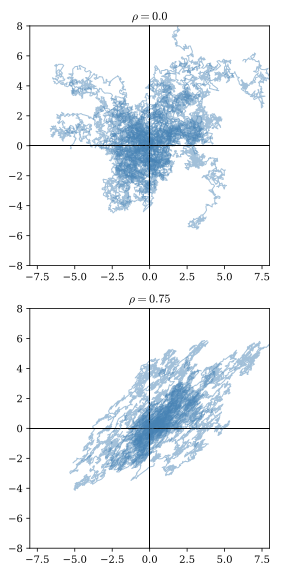
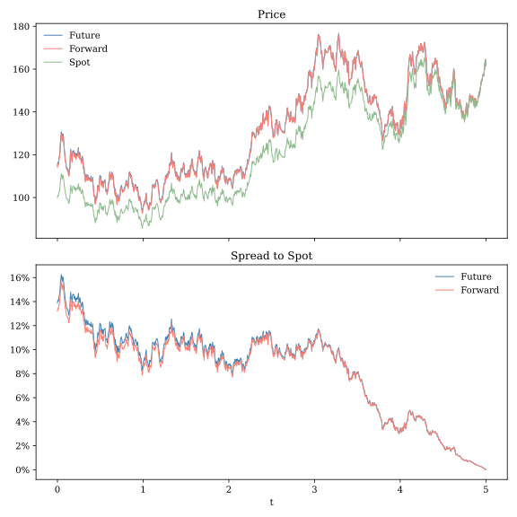

# Models with Multiple Sources of Uncertainty

WORKING DRAFT

THIS CHAPTER IS NOT READY FOR REVIEW

 
All of the models we have encountered thus far involve only one source of uncertainty.  In the basic Black-Scholes model a single Wiener process drives th geometric Brownian motion asset price process.  Likewise, in the Vasicek and Cox-Ingersol-Ross models, a single Wiener process determines the evolution over time of the short interest rate.  In this chapter we will show how the tools of Ito calculus can be generalized to work with models involving systems of correlated Wiener processes. We will then illustrate the application of these tools to price futures and forward contracts.
 
## Correlated Wiener processes
 
A system of correlated Wiener processes can be constructed from a linear combination of independent processes.
 
::: {.callout-tip title="Correlated Wiener Processes"}
Let $\mathbf{\Sigma}$ be an $n$-dimensional positive definite correlation matrix and let $\mathbf{C}$ be a positive definite factor of $\mathbf{\Sigma}$ such that $\mathbf{C}\mathbf{C}' = \mathbf{\Sigma}$. If $\mathbf{Z}_t = \left(z_t^{(1)},\ldots,z_t^{(n)}\right)'$ is an $n$-vector of independent Wiener processes then
 
$$
\mathbf{W}_t = \mathbf{C}\mathbf{Z}_t
$$
 
is an $n$-vector of **correlated Wiener processes** with instantaneous covariance matrix $\mathbf{\Sigma}$. Increments of $\mathbf{W}_t$ satisfy
 
$$
\mathbf{W}_{t+\Delta t} - \mathbf{W}_t \sim N\left(\mathbf{0},\; \mathbf{\Sigma}\,\Delta t)\right).
$$
 
Disjoint increments of $\mathbf{W}_t$ are independent. Each element $W_t^{(i)}$ of $\mathbf{W}_t$ is a univariate Wiener process.
:::

While any number of correlated Wiener processes may be used in real-world financial modeling applications, in this introductory text we will generally only work with two correlated processes at a time.  In the two-dimensional case the factor matrix can be written as
 
$$
\mathbf{C} = \begin{bmatrix}1 & 0 \\ \rho & \sqrt{1-\rho^2}\end{bmatrix}
$$
 
so that $W_t^{(1)} = Z_t^{(1)}$ and $W_t^{(2)} = \rho\,Z_t^{(1)} + \sqrt{1-\rho^2}\,Z_t^{(2)}$.  The covariance between contemporaneous increments is $Cov\left[\Delta W^{(1)}_t, \Delta W^{(2)}_t\right] = \rho\Delta t$. 
 
@fig-biv_wiener shows two examples of simulated paths traced out by pairs of Wiener processes on two-dimensional planes.  In the first panel, the two processes are uncorrelated ($\rho=0$) and the paths fill a circular region centered at the origin.  In the second panel the processes are positively correlated ($\rho=0.75$) and the paths fill an elliptical area.  The simulated paths are less likely to enter the upper-left and lower-right quadrants because when $W_t^1$ and $W_t^2$ are positively correlated realized values of the two processes at a point in time are less likely to be of opposite signs.

{#fig-biv_wiener}

## Ito calculus for correlated Wiener processes
 
The rules for working with individual Wiener process differentials described in @tbl-ito_rules apply to each element of a vector of Wiener processes as well.  However, when these processes are correlated we must also consider the possibility that differentials of correlate processes may interact with one another.  Recall that for a single process $(dW_t)^2$ is of order $O(dt)$ and, because the squared differential converges in mean square to $dt$ as $dt$ approaches $0$, we can use the substitution rule $(dW_t)^2 = dt$.  Similar reasoning leads to a substitution rule for the product of two contemporaneous Weiner process differentials.
 
$dW_t^{(1)}$ and $dW_t^{(2)}$ are both of order $O(\sqrt{dt})$ so $dW_t^{(1)} dW_t^{(2)}$ is of order $O(dt)$. The mean of this product of differential is
 
$$
\begin{align*}
\E\left[dW_t^{(1)} dW_t^{(2)}\right] =& E\left[dZ_t^{(1)}\left(\rho\,dZ_t^{(1)}+\sqrt{1-\rho^2}\, dZ_t^{(2)}\right)\right] \\
=& \rho\,E\left[\left(dZ_t^{(1)}\right)^2\right] + \rho\,\sqrt{1-\rho^2}\,E\left[ dZ_t^{(1)}\,dZ_t^{(2)}\right] \\
=& \rho\,dt.
\end{align*}
$$
 
The variance is
 
$$
\begin{align*}
\Var\left[dW_t^{(1)} dW_t^{(2)}\right] =& E\left[\left(dW_t^{(1)} dW_t^{(2)}\right)^2\right] - E\left[dW_t^{(1)} dW_t^{(2)}\right]^2 \\
=& E\left[\left(dZ_t^{(1)}\left(\rho\,dZ_t^{(1)}+\sqrt{1-\rho^2}\, dZ_t^{(2)}\right)\right)^2\right] - \rho^2\,dt^2 \\
=& \rho^2 E\left[\left(dZ_t^{(1)}\right)^4\right] \\
&+ (1-\rho^2)E\left[\left(Z_t^{(1)}\right)^2\right]E\left[\left(Z_t^{(2)}\right)^2\right] \\
&+ \rho\sqrt{1-\rho^2}E\left[\left(Z_t^{(1)}\right)^3\right]E\left[Z_t^{(2)}\right] \\
&- \rho^2\,dt^2 \\
=& \rho^2 3\,dt^2 + (1-\rho^2)\,dt^2 - \rho^2\,dt^2 \\
=& (1+\rho^2)dt^2.
\end{align*}
$$
 
Thus
$$
\begin{align*}
\lim_{dt\to 0}\E\left[dW_t^{(1)} dW_t^{(2)}-\rho\,dt\right] &= \lim_{dt\to 0} \Var\left[dW_t^{(1)} dW_t^{(2)}\right] \\
&= \lim_{dt\to 0} (1+\rho^2)dt^2 \\
&= 0,
\end{align*}
$$
and therefore $dW_t^{(1)}dW_t^{(2)} \toms\,\rho dt$ as $dt\to 0$.  In working with products of correlated Wiener process differentials we can apply the substitution rule
 
$$
dW_t^{(1)}dW_t^{(2)} = \rho\,dt.
$$
 
We can use this substitution rule along with the ones for single Wiener processes to derive a bivariate version of Ito's Lemma.  Suppose we have two correlated Ito processes,
 
$$
dX_t = \mu_t^X dt + \sigma_t^X dW_t^X
$$
 
and
 
$$
dY_t = \mu_t^Y dt + \sigma_t^Y dW_t^Y.
$$
 
From our derivation of the single variable version of Ito's Lemma, we know that $(dX)^2 = \sigma^X dt$ and $(dY)^2 = \sigma^Y dt$.  And, using our new substitution rule for the product of correlated Wiener processes,
$$
\begin{align*}
dXdY =& (\mu_t^X dt + \sigma_t^X dW_t^X)(\mu_t^X dt + \sigma_t^X dW_t^X) \\
=& \mu^X\mu^Y (dt)^2 + \mu^X\sigma^Y(dtdW^Y) + \mu^Y\sigma^X(dtdW^X) + \sigma^X\sigma^Y(dW^XdW^Y) \\
=& \sigma^X \sigma^Y \rho\,dt.
\end{align*}
$$
 
Now consider a smooth function $f(x,y)$ with first and second partial derivatives $f_x$, $f_y$, $f_{xx}$, $f_{yy}$ and $f_{xy}$.  We can express a second-order Taylor series expansion for the change in $f(X,Y$)$ in differential form as 
 
$$
\begin{align*}
df(X,Y) =&
f_x dX + f_y dY +
\frac12 f_{xx} (dX)^2 + \frac12 f_{yy}(dY)^2 + f_{xy}dX dY \\
=& f_{x}(\mu^X dt + \sigma^X dW^X) \\
&+ f_{y}(\mu^Y dt + \sigma^X dW^Y) \\
&+ \frac12 f_{xx}\sigma^X dt + \frac12 f_{yy}\sigma^Y dt + f_{xy}\sigma^X\sigma^Y\rho dt \\
=& \left(f_x\mu^X + f_y\mu^Y + \frac12 f_{xx}\sigma^X + \frac12 f_{yy}\sigma^Y + f_{xy}\sigma^X\sigma^Y\rho\right)dt \\
&+ f_x \sigma^X dW^X + f_y \sigma^Y dW^Y.
\end{align*}
$$
 
Just as with the univariate version of Ito's Lemma, second-order differentials contribute to the drift of the transformed stochastic process.  If we allow the function to also depend on time, we can easily derive the slightly more general version of Ito's Lemma for a pair of correlated Ito processes.

::: {.callout-note title="Ito's Lemma (Bivariate Case)"}
Let $\{(X_t,Y_t)\}$ by a bivariate stochastic process that satisfies the SDEs

$$
dX_t = \mu^x_t\,dt + \sigma^x_t\,dW^x_t,
$$
and

$$
dY_t = \mu^y_t\,dt + \sigma^y_t\,dW^y_t
$$
with $\E[dW^x_t dW^y_t] = \rho$, and let

$$
f(t,x,y)
$$

be a function that is continuously differentiable in $t$ and twice continuously differentiable in $x$ and $y$.

Then the process

$$
Y_t = f(t,X_t,Y_t)
$$

satisfies

$$
\begin{align*}
df(t,X_t,Y_t)
=&
\frac{\partial f}{\partial t}\,dt
+
\frac{\partial f}{\partial x}\,dX_t
+
\frac{\partial f}{\partial y}\,dY_t \\
&+
\frac{1}{2}
\frac{\partial^2 f}{(\partial x)^2}
(dX_t)^2
+
\frac{1}{2}
\frac{\partial^2 f}{(\partial y)^2}
(dY_t)^2
+
\frac{\partial^2 f}{(\partial x\partial y)}
(dX_t dY_t),
\end{align*}
$$

or equivalently,

$$
\begin{align*}
df(t,X_t)
=&
\left(
\frac{\partial f}{\partial t}
+
\mu^x_t
\frac{\partial f}{\partial x}
+
\mu^y_t
\frac{\partial f}{\partial y}
+
\frac{(\sigma^x_t)^2}{2}
\frac{\partial^2 f}{(\partial x)^2}
+
\frac{(\sigma^y_t)^2}{2}
\frac{\partial^2 f}{(\partial y)^2}
+
\sigma^x_t \sigma^y_t
\frac{\partial^2 f}{\partial x\partial y}
\right)
dt \\
&+
\sigma^x_t
\frac{\partial f}{\partial x}
\,dW^x_t
+
\sigma^y
\frac{\partial f}{\partial y}
\,dW^y_t.
\end{align*}
$$
:::
 
A direct corollary to Ito's Lemma is a product rule for correlated Ito processes.  If $X$ and $Y$ are Ito processes then
 
$$
d(X\,Y) = X\,dY + Y\,dX + \rho\,\sigma^x\sigma^y \,dt.
$$
 
## The GBM-Vasicek model under the risk-neutral measure {#sec-gbm_vasicek}
 
In this section we will develop key results needed to value derivatives on an asset such as an equity security or equity index when future interest rates are uncertain.  Assume that under the physical measure the asset follows the GBM process
 
$$
\frac{dS_t}{S_t} = \mu\,dt + \sigma_S\,dW_t^S
$$
 
and, as in the Vasicek model, the short rate follows an Ornstien-Uhlenbeck process
 
$$
dr_t = \kappa\,(\theta - r_t) + \sigma_r\,dW_t^r.
$$
 
To capture the idea that equity returns may reflect the current state of the economy we assume that
 
$$
\Cov[W_t^S,W_t^r] = \rho.
$$
 
We would usually expect $\rho$ to be positive, consistent with the idea that interest rates and equity returns tend to rise when the economy is growing more quickly.
 
As in @sec-vasicek, we can use Girsanov's Theorem to derive an short-rate process under the risk-neutral measure.  If we assume a constant risk premium parameter, then the only thing that changes in the short-rate process is the value of $\theta$.  Similarly, as in @sec-q_measure_bs, the FTAP implies that the risk-neutral drift will be equal to the short rete.  Thus, under the $Q$-measure we have
 
$$
\frac{dS_t}{S_t} = r_t\,dt + \sigma_S\,dW_t^{QS}
$$
 
and
 
$$
dr_t = \kappa\,(\theta_Q - r_t) + \sigma_r\,dW_t^{Qr}.
$$
 
Importantly, the correlation parameter and volatility parameters do not change when we move from the physical to the risk neutral measure.

Let $V(S_t,r_t,t)$ be the value at time $t$ of an option or other derivative whose final payoff $V(S_T,r_T,T)$ is tied to the value of the reference asset $S_T$ and possibly the prevailing short rate $r_T$.  To keep notation under control, we will drop time subscripts for the time being and use subscripts to denote partial derivatives instead.  For example $V_S$ is the partial derivative of $V$ with respect to $S$.  Observe from the Wiener process substitutions rules that $(dS)^2 = S\sigma_S dt$, $(dr)^2 = \sigma_r dt$, and $(dSdr) = S\sigma_S\sigma_r\rho dt$
 
$$
\begin{align*}
dV =& V_t dt + V_S dS + V_r dr + \frac12 V_SS(dS)^2 + \frac12 V_{rr}(dr)^2 + V_{Sr} (dS\,dr)\\
=& V_t dt + V_S (S\,r\,dt + S\,\sigma_S\,dW^S) + V_r(\kappa\,(\theta - r)dt + \sigma_r\,dW^{r}) \\
&+ \frac12 V_{SS}S\,\sigma_S\,dt + \frac12 V_{rr}\sigma_r\,dt + V_{Sr}\sigma_S\,\sigma_r\,\rho\,dt \\
=& \left(V_t + V_S\,S\,r + V_r(\kappa\,(\theta - r) + \frac12 V_{SS}S\,\sigma_S + \frac12 V_{rr}\sigma_r + V_{Sr}\sigma_S\,\sigma_r\,\rho\right)dt \\
&+ V_S\,S\,\sigma_S\,dW^S + V_r\,\sigma_r\,dW^{r}).
\end{align*}
$$
 
Note that, as with with our earlier fixed interest rate GBM model, $V(S,r,t)$ is an Ito process.  The derivative is a traded asset, so the FTAP implies that the drift term is equal to $V\,r$. Thus
 
$$
\begin{align*}
Vr =& V_t + V_S\,S\,r + V_r\kappa\,(\theta - r) \\
&+ \frac12 V_{SS}S\,\sigma_S 
+ \frac12 V_{rr}\sigma_r + V_{Sr}\sigma_S\,\sigma_r\,\rho.
\end{align*}
$$
 
This is a generalization of the Black-Scholes pricing PDE we derived in @sec-hedging_portfolio.  It is identical to the earlier version but includes additional terms that capture the effects of changes in the short rate.

To price derivatives on the asset we will need to know its $Q$-measure transition distribution of the reference asset and the $Q$-measure transition distribution of its discounted present value.  Deriving these distributions involves math we have already seen; the main challenge is simply keeping our notation from getting out of hand.  Throughout this discussion we will be working with the risk-neutral measure, so we will drop notation that distinguished between physical and risk-neutral parameters.

Applying Ito's Lemma to $\ln(S_t)$ and integrating the resulting PDE yields

$$
\begin{align*}
\ln(S_T)
=&
\ln(S_t)
+
\int_t^T r_s\,ds
-\frac12\sigma_S^2\,(T-t)
+\sigma_S\,(W_T^S-W_t^S) \\
=&
\ln(S_t) - \frac12\sigma_S^2\,(T-t)
+ I_{t,T} + \sigma_S Y_{t,T}.
\end{align*}
$$
Notice that this is very similar the PDE solution we derived for a GBM process under the physical measure in @sec-gbm.  Our solution involves two random variables: the Wiener process increment 

$$
Y_{t,T} = W_t^S-W_t^S
$$ 
and the integrated short rate 

$$
I_{T,t} = \int_t^T r_s\,ds.
$$

From the Wiener process definition we know that $Y_{t,T} \sim N(0,\,(T-t))$. In @sec-vasicek we found that under the Vasicek model the integrated short-rate process is also normally distributed with mean

$$
m_I = \theta\,(T-t) + (r_t - \theta)\,\mathcal{B}(t,T)
$$
and variance
$$
v_I =\frac{\sigma_r^2}{\kappa^2} \left( 
    (T-t) - 2\mathcal{B}(t,T) + \frac{1}{2\kappa} \left(1-e^{-2\kappa\,T}\right)\right),
$$
where

$$
\mathcal{B}(t,T) = \frac{1-e^{-\kappa\,(T-t)}}{\kappa}.
$$

Thus $\ln(S_T)$ is equal to a constant term plus the sum of two random variables. We now know that $\ln(S_t)$ is normally distributed; we just need to determine its mean and variance.

$I_{t,T}$ and $Y_{t,T}$ depend on correlated Wiener processes, so they are correlated as well.  The covariance between them is

$$
\begin{align*}
c_{IY} =& \Cov_t^Q[I_{t,T},Y_{t,T}] \\
=& \E_t^Q\left[\left(I_{t,T}-m_I\right)Y_{t,T}\right] \\
=& \E_t^Q\left[\left(\sigma_r\int_t^T \mathcal{B}(s,T)dW_s^r\right)
\left(\int_t^T dW_s^S\right)\right] \\
=& \rho\,\sigma_r\,\int_t^T \mathcal{B}(s,T)ds \\
=& \rho\,\frac{\sigma_r}{\kappa}\left((T-t)-\mathcal{B}(t,T)\right).
\end{align*}
$$
Thus, using the standard properties of correlated normal random variables, we have

$$
\ln(S_T)\;|\;\mathcal{F}_t \sim 
N\left(\ln(S_t) - \frac12\sigma_S^2\,(T-t) + m_I,\; v_I + \sigma^2_S(T-t) + 2\sigma_S\,c_{IY}\right).
$$
The discounted present value of $S_T$ at date $t$ is

$$
\tilde S_t = e^{-\int_t^Tr_sds}S_t = e^{-I_{t,T}}S_T.
$$

Or, in log form,

$$
\begin{align*}
\ln(\tilde S_t) =& \ln(S_t) - I_{t,T} \\
=& \ln(S_t) - \frac12\sigma_S^2\,(T-t)
+ I_{t,T} + \sigma_S Y_{t,T} - I_{t,T} \\
=& \ln(S_t) - \frac12\sigma_S^2\,(T-t)
+ \sigma_S Y_{t,T}. 

\end{align*}
$$
As with the fixed interest rate version of the GBM model, discounting the $Q$ measure process removes the trend term, giving us the simple transition distribution

$$
\ln(\tilde S_t) \;|\;\mathcal{F}_t \sim N\left(\ln(S_t) - \frac12\sigma_S^2\,(T-t),\;\sigma_S^2\,(T-t)\right).
$$
It follows that $S_T$ and $\tilde S_T$ each have lognormal distributions.

## Revisiting the relationship between futures and forwards prices

In @sec-f_and_f we saw that the futures price $F_t$ for a contract to receive delivery of a reference asset at date $T$ is
$$
F_t = \E_t^Q[S_T].
$$

With our model of the reference asset value process $\{S_t\}$ in hand, we can now compute the futures price explicitly. In @sec-gbm_vasicek we showed that under the $Q$ measure $\ln(S_T)| \mathcal{F}_t$ has a normal distribution with a known mean.  From @thm-lognormal-moments, we can conclude that

$$
\begin{align*}
\ln(F_t) =& \E_t^Q[\ln(S_T)] + \frac12\Var[\ln(S_T)] \\
=&\ln(S_t) - \frac12\sigma_S^2\,(T-t) + m_I + \frac12 \left(v_I + \sigma^2_S(T-t) + 2\sigma_S\,c_{IY}\right) \\
=& \ln(S_t) + m_I + \frac12v_I + \sigma_S c_{IY}.
\end{align*}
$$
Or, equivalently,

$$
F_t = S_t\,e^{m_I + \frac12v_I + \sigma_S c_{IY}}.
$$
The futures price is the current spot price scaled by three factors: the expected integrated short-rate path, a convexity adjustment that arises from uncertainty in the short-rate path, and an adjustment for correlation between the short rate and the value of the reference asset.

Recall from @sec-f_and_f that the forward price $K_t$ to receive the same asset is

$$
K_t = \frac{S_t}{P_{t,T}}
$$
where $P_{i,T}$ is the price of a zero-coupon bond derived in @sec-vasicek.  Using notation define in @sec-gbm_vasicek, the bond price can be written as

$$
P_{t,T} = e^{-m_I + \frac12 v_I}
$$
and the forward price is

$$
K_t = S_t\,e^{m_I-\frac12 v_I}.
$$

The future and forward price both depend on the current spot price and the $Q$-measure expected short-rate path, but they involve different convexity adjustments arising from differences in the timing of cash flows between the buyer and seller.  Expressed as a ratio, this difference is

$$
\frac{F_t}{K_t} = e^{v_I + \sigma_S c_{IY}}
$$
The difference between futures and forwards prices depends on both the level of uncertainty in short rate path (v_I) and interest-asset correlation $\sigma_S c_{IV}$.  

A couple of special cases are worth noting.  Suppose, as in @sec-q_measure_bs, that the short rate is fixed.  In this case $v_I = c_{IY} = 0$ and the futures and forwards prices are identical.  The should not be surprising.  In @sec-f_and_f we showed that the two prices will match when $\Cov_t^Q[f_{t,T}, S_T] = 0$. But now suppose that the short rate is uncertain but is uncorrelated with $S_T$, so that $c_{IY}=0$ but $v_I > 0$.  Perhaps unexpectedly, $F_t > K_t$.  

Does this contradict our finding from @sec-f_and_f?  No. The discount rate $f_{t,T}$ is a nonlinear function of $I$ and the asset price $S_T$ is a nonlinear function of both $I$ and $Y$. Volatility in the integrated interest rate path can induce correlation between the discount rate and the reference asset price even if shocks to the two processes are independent.  It is not enough for the underlying sources of uncertainty to be uncorrelated. What matters for the forward–futures relationship is the covariance between the stochastic discount factor and the terminal asset price. In models with stochastic interest rates, this dependence arises naturally because the short rate both determines the discount factor and enters the risk-neutral dynamics of traded asset prices.

@fig-f_and_f shows the simulated time path for a stock price and the prices of a futures contract and a forward contract on that stock. Both the futures and the forward price converge to the spot price as the expiry date approaches. For plausible parameter values the gap between the forward and futures is small relative to the gap between both prices and the spot price.

{#fig-f_and_f}

## Options pricing with stochastic interest rates
 
Adding stochastic interest rates to our model gives us one more "greek" and a few additional unnamed sensitivity parameters with which evaluate options, as shown in the following alternative form of the pricing PDE:
 
$$
\begin{align*}
Vr =& \Delta\,S\,r + \Theta + \frac12 \Gamma S\,\sigma_S \\
&+ \mathrm{P}\,\kappa\,(\theta - r)  + \frac12 V_{rr}\sigma_r + V_{Sr}\sigma_S\,\sigma_r\,\rho.
\end{align*}
$$
 
$\mathrm{P} = \frac{\partial V}{\partial r}$, describes an option value's sensitivity to small changes in the short interest rate.^[$\mathrm{P}$ is the capital Greek letter "rho".  This naming convention is a bit unfortunate, as the lower-case Greek rho ($\rho$) is used here and elsewhere to denote correlation between two random variables.]  The short rate affects the option price through two channels.  First, a higher expected interest rate path means that future payouts are discounted more heavily, driving down the value of claims on future cash flows.  Second, the interest rate affects the rate of growth of the reference asset under the risk neutral measure.  This may either have a positive or negative relation to the option value, depending on whether the option is long or short with respect to the reference asset.  $V_{rr}$ reflects the convexity of the option value with respect to changes in interest rates, similar to the way $\Gamma$ captures the nonlinear relationship between the option value and the value of the reference asset.  $V_{Sr}$ captures second-order interactions between the reference asset and the short rate.

