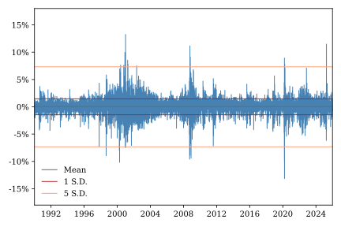
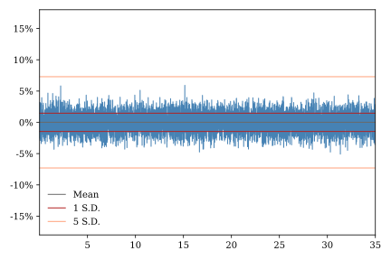
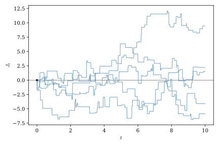
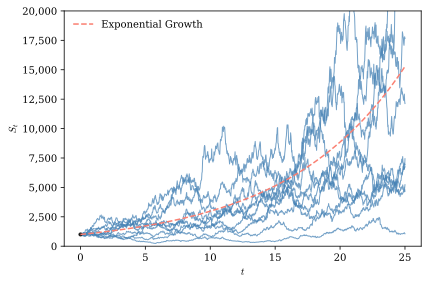
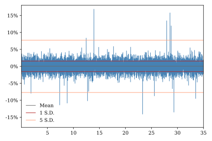

# Jump-Diffusion Models {#sec-jump_processes}

In all of the models we have considered thus far, uncertainty has been driven by Wiener diffusion processes. Wiener processes are a flexible and robust tool for modeling uncertainty over time, but they can fail to capture important features of real-world financial market data. Rare, unexpected news events or market disruptions can cause asset prices to move far more than would be predicted by typical diffusion models. For example, take a look at @fig-nas_daily_ret, which shows daily returns for the NASDAQ composite stock index. On several days since 1990 the index has moved up or down by more than five standard deviations. Compare this with @fig-gbm_daily_ret, which shows simulated returns for a geometric Brownian motion process. If NASDAQ returns were normally distributed, as implied by the geometric Brownian motion model, the odds of even one five-standard-deviation move would be less than one-in-three-million. One approach to accounting for rare but large shifts in asset prices is to incorporate discontinuous jump processes into our models. In this chapter we examine the stochastic calculus of simple jump processes and illustrate their application using a classic model of equity prices.

{#fig-nas_daily_ret}

{#fig-gbm_daily_ret}

## The compound Poisson process

In @sec-processes we introduced the Poisson process, which describes the number of discrete events that accumulate over a period of time. The compound Poisson process augments the Poisson process by modeling the size of events as well as their number.

::: {.callout-tip title="Compound Poisson Process"}
Let $N_t$ be a Poisson process with intensity parameter $\eta$ and let $Y_1, Y_2, ...$ by i.i.d. random variables that are independent of $N_t$. The **compound Poisson process** is

$$
J_t = \sum_i^{N_t} Z_i
$$

$J_t$ changes only when a jump occurs, but these changes cause discontinuities in the sample paths. For this reason the compound Poisson process is often called a jump process.

Let $m = \E[Z_i]$ and $v = \operatorname{Var}[Z_i]$, then the mean and variance of the compound Poisson process are given by

$$
\E[J_t] = \eta\,m\,t
$$

and

$$
\operatorname{Var}(J_t) = \eta\,(v+m^2)\,t.
$$

Increments of a compound Poisson process, $J_{t+h}-J_t$, are themselves compound Poisson random variables with mean and variance proportional to $h$. Increments of disjoint intervals are independent.
:::

Figure @fig-cpp_paths shows simulated sample paths for a compound Poisson process with standard normal jump sizes. In this example, the mean jump size is zero so the process has no trend. Like the compensated Poisson process we saw in @sec-martingales, it is a martingale. More generally, the trend in $J_t$ is the product of the jump arrival intensity, $\eta$, and the mean jump size, $m$. Depending on the application, any number of different distributions might be used to model jump sizes. Later in this chapter we will make use of a process with shifted lognormal jumps.

{#fig-cpp_paths}

We have seen in previous chapters that the way new information arrives is central to the definitions of both Ito integrals and martingales, important tools in our continuous-time financial modeling toolkit. Recall that a filtration $\{\mathcal{F}_t\}$ represents the information available to market participants over time. A stochastic process is adapted to a filtration if its value at time $t$ is determined only by information contained in $\mathcal{F}_t$. Continuous processes, such as the Wiener process, evolve smoothly, so there is no distinction between the value of the process immediately before and immediately after a given instant.

Working with jump processes requires a little more care. We assume that they are adapted, but not predictable in the sense described in @sec-filtrations. When a jump occurs, the process changes discontinuously, so we must distinguish between its value immediately before and immediately after the jump. Throughout this book we adopt the standard convention that jump processes have **càdlàg** sample paths -- that is, they are right-continuous with left limits. If a jump occurs at time $t$, the notation $J_{t^-}$ denotes the value of the process immediately before the jump, while $J_t$ denotes its value immediately afterward. This convention captures the idea that trading decisions made at time $t$ must be based on information available immediately before any jump that might occur at that instant.

## Stochastic calculus for jump processes

Earlier we developed tools for working with Ito processes that combine a deterministic drift component with a stochastic Wiener process component. In this section we will augment this toolkit, enabling us to manipulate processes that also include a jump component. The differential notation introduced in @sec-differentials extends naturally to Poisson and compound Poisson processes. As with Wiener processes, the resulting differential rules allow us to work with stochastic differential equations using ordinary algebra.

The differential rules for Wiener and Poisson processes arise for fundamentally different reasons. For Wiener processes, the increments themselves are infinitesimal, and the rules follow from comparing the orders of magnitude of different terms. For Poisson processes, however, the increment $dN_t$ is either zero or one. The increment is not small; rather, the probability of observing a nonzero increment over an infinitesimal interval is small. The key observation is that, over an infinitesimal time interval, $dt$, a Poisson process either records no jump or exactly one jump. Consequently,

$$
dN_t =
\begin{cases}
1, & \text{if a jump occurs during } [t,t+dt), \\
0, & \text{otherwise.}
\end{cases}
$$

Since $dN_t$ can take only the values $0$ and $1$, its powers satisfy

$$
(dN_t)^k = dN_t,
\qquad k \ge 1.
$$

In particular,

$$
(dN_t)^2 = dN_t.
$$

This identity is the jump-process analogue of the familiar Wiener result $(dW_t)^2 = dt$. Unlike the Wiener case, however, it follows directly from the fact that squaring either $0$ or $1$ leaves the value unchanged.

As before, products involving $dt$ are negligible because $dt$ is infinitesimal. As a result

$$
dt\,dN_t = 0,
$$

and, more generally,

$$
(dt)^m(dN_t)^n = 0,
\qquad m \ge 1,\; n \ge 1.
$$

If the Poisson process is independent of the Wiener process then their product is also negligible:

$$
dW_t\,dN_t = 0.
$$

These rules provide the algebraic foundation for extending Itô calculus to jump processes. The extension of these rules to compound Poisson processes follows directly from the definition of $dN_t$. If

$$
J_t = \sum_i^{N_t} Z_i
$$

then

$$
dJ_t = dN_t\,Z_t.
$$

Thus, when working with the differential of a compound Poisson process, we can first convert it to a function involving a Poisson process differential and then apply the rules for Poisson processes.

The stochastic integral for the Poisson process is defined in almost exactly the same way as the Ito integral for the Wiener process. Divide the interval $[0,T]$ into $n$ subintervals

$$
0=t_0<t_1<\cdots<t_n=T
$$

so that $\Delta N_{t_i} = N_{t_{i+i}}-N_{t_i}$ is the Poisson increment corresponding to subinterval $[t_i,t_{i+1}]$, and let $$
I_n = \sum_{i=0}^{n-1} X_{t_i} \Delta N_{t_i},
$$

where $\{X_t\}$ is a a predictable Ito process. Then $$
I = \lim_{n\to\infty} I_n = \int_0^T X_t\,dN_t 
$$

is the integral of $X_t$ with respect to the Poisson process.

This integral has a particularly simple interpretation. Each term in $I_n$ is equal to either zero or $X_{t_i}$ depending on whether $[t_i,t_{i+t}]$ contains a jump. Thus

$$
\int_0^T X_t\,dN_t=\sum_{i=1}^{N_T}X_{\tau_i^-},
$$

where $0 < \tau_1 < \tau_2 < \ldots T$ denotes the random jump times of $\{N_t\}$. Unlike an Itô integral, it is simply the sum of the integrand evaluated at each jump. Note that, even if $X_t$ is a deterministic function, the integral is a random variable that depends on the Poisson process $\{N_t\}$.

A general **jump-diffusion process** can be written as

$$
dX_t = \mu(X_t,t)\,dt + \sigma(X_t,t)\,dW_t + dJ_t,
$$

where $W_t$ is a standard Wiener process and $J_t$ is a compound Poisson jump process. A jump-diffusion process is the sum of two independent sources of randomness. The Wiener process models the continuous accumulation of many small shocks, while the compound Poisson process models rare but potentially large discontinuous events. By combining the two, we obtain a flexible class of stochastic processes capable of describing both gradual fluctuations and sudden jumps.

The extension of Itô's lemma to jump-diffusion processes is remarkably simple. Between jumps, the process evolves continuously and the usual Itô formula applies. When a jump occurs, however, the change in the process is finite rather than infinitesimal. So, instead of approximating the change in the function using a Taylor expansion, we simply evaluate its exact change across the jump.

If $X_t$ is a jump-diffusion process and $f(x,t)$ is continuously differentiable with respect to $t$ and twice continuously differentiable with respect to $x$, then

$$
\begin{aligned}
df(X_t,t)
={}&
\left(
\frac{\partial f}{\partial t}
+
\mu
\frac{\partial f}{\partial x}
+
\frac{1}{2}\sigma^2
\frac{\partial^2 f}{\partial x^2}
\right)dt
+
\sigma
\frac{\partial f}{\partial x}
\,dW_t \\
&
+
\Bigl[
f(X_{t},t)
-
f(X_{t^-},t)
\Bigr]dN_t.
\end{aligned}
$$

The first line is identical to the ordinary Itô formula for continuous diffusion processes. The second line is the jump correction. Whenever no jump occurs $dJ_t=0$, so this term vanishes. When a jump does occur, it contributes the exact change in the function resulting from the discontinuous movement in the underlying process.

## The Merton jump-diffusion model {#sec-merton_jd}

The @merton1976jump jump-diffusion model extends the GBM equity price mode we first encountered in @sec-gbm to allow for discontinuous jumps in the value of an asset. Under the basic GBM model $S_t$, follows the SDE

$$
\frac{dS_t}{S_t} = d\ln(S_t) = \mu\,dt + \sigma\,dW_t.
$$ 

Now suppose we maintain this assumption at most points in time, but introduce a separate jump process that causes $S_t$ to shift in discontinuous jumps at random times. Jumps arrive according to a Poisson process, $\{N_t\}$. We assume that the jumps in value are multiplicative so that when jumps arrive they scale $S_t$ up or down by a random amount in proportion to its current level. The $i\text{th}$ such shift is described by the random variable $Y_i$. If this jump arrives at time $t$ then

$$
S_t = Y_i\,S_{t^-}.
$$ 

In this case

$$
\Delta S_t = Y_t\,S_{t^-}-S_{t^-} = (Y_t-1)\,S_{t^-} 
$$ If no jump occurs over the interval $[t, t+dt]$ then $S_t$ follows a GBM process. If a jump occurs in the interval then it follows a GBM process but also shifts by the amount $(Y_t-1)\,S_{t^-}$. Whether or not a jump occurs is determined by $dN_t$, so the SDE for $S_t$ becomes

$$
dS_t = S_{t^-}\,\mu\,dt + S_{t^-}\,\sigma\,dW_t + (Y_t-1)\,S_{t^-}\,dN_t
$$ 

or, equivalently, 

$$
\frac{dS_t}{S_{t^-}} = d\ln(S_t) = \mu\,dt + \sigma\,dW_t + (Y_t-1)\,dN_t.
$$

Thus, the price growth dynamics are determined by the GBM process we have already seen plus a compound Poisson process where $Z_i = Y_i-1$. To ensure that the multiplicative jump sizes are strictly positive, we assume that

$$
\ln(Y_i) \sim N(\alpha\,,\,\delta^2).
$$ 

This setup described a jump-diffusion process where the Ito process component is geometric Brownian motion and the jump component is a compound Poisson process with jump sizes that are shifted lognormal random variables.

At this point it should come as no surprise that the solution to this SDE lies in applying Ito's Lemma. The extended version of Ito's Lemma for jump diffusion processes implies that

$$
d\ln{S_t} = \left(\mu - \frac12 \sigma^2\right)\,dt + \sigma\,dW_t + \ln(Y_t.)\,dN_t.
$$

Integrating both sides yields

$$
\begin{align*}
\int_0^Td\ln{S_t} =& \int_0^T\left(\mu - \frac12 \sigma^2\right)\,dt + \int_0^T\sigma\,dW_t + \int_0^T\ln(Y_t)\,dN_t \\
\ln(S_T)-\ln(S_0) =& \left(\mu - \frac12 \sigma^2\right)T + \sigma\,W_T + \sum_{\tau_i=0}^{N_T}\ln(Y_{\tau_i}) \\
\ln(S_T) =&\ln(S_0) + \left(\mu - \frac12 \sigma^2\right)T + \sigma\,W_T + \sum_{i=i}^{N_T}\ln(Y_{\tau_i}).
\end{align*}
$$

This pathwiise solution to the SDE if nearly identical to the solution to the GBM SDE. The only difference is the final term which captures the accumulation of jumps up to time $T$.

As with the GBM process, we can characterize the transition distribution for the Merton jump-diffusion Process, though this characterization does not yield a simple closed-form expression for the probabiity density function. Looking at our pathwise solution, we see that if $N_T=n$ then $\ln(S_t)$ is a constant plus a weighted sum of $n+1$ independent normal random variables. Thus, we have

$$
\ln(S_t)\mid N_t \sim N\left(\ln(S_0) + \left(\mu - \frac12 \sigma^2\right)t + N_t\,\alpha,\;\sigma^2\,t + N_t\,\delta^2 \right).
$$

We do not know $N_t$, of course, but we can determine the unconditional transition distribution by integrating it out, producing a Poisson-normal mixture distribution. The probability density function for $X_t=\ln(S_t)$ is given by

$$
f(x) = \sum_{n=0}^{\infty} \phi\left(\frac{x-\left(\ln(S_0) + \left(\mu - \frac12 \sigma^2\right)t + n\,\alpha\right)}{\sqrt(\sigma^2\,t + n\,\delta^2)}\right)p(n\,;\,\eta)
$$ where $\phi(\cdot)$ is the standard normal PDF, and $p(\cdot;\,\eta)$ is the probability mass function for a Poisson distribution with arrival intensity $\eta$. This function can be approximated to any desired level of precision by simply truncating the series on the right-hand-side or using Fourier transforms. Furthermore the Poisson-normal mixture distributions' moment generating function is know, so we can compute any moments we wish. $S_t$ has a Poisson-lognormal mixture distribution, which is similarly easy to deal with.

@fig-merton_paths shows simulated paths for a Merton jump-diffusion process calibrated using moments of the NASDAQ equity index from 1990 to 2026. @fig-mjd_daily_ret shows simulated daily returns for the same model. Comparing this figure with @fig-gbm_daily_ret we see that the jump-diffusion model is much better able to capture the occasional large jumps in equity prices observed in real-world data.

{#fig-merton_paths}

{#fig-mjd_daily_ret}

## Options pricing in the presence of jumps {#sec-mjp_pricing}

The Merton jump-diffusion model differs in a fundamental way from the models we have seen up to this point. Unlike the basic Black-Scholes GBM pricing framework, which assumes a single source of uncertainty that can be hedged using tradable assets, the Merton model describes an incomplete market. There are multiple sources of uncertainty -- the diffusion process, the jump process, and the jump sizes -- that cannot all be hedged in a portfolio consisting of a single traded asset and a derivative. More fundamentally, since the jump process is not predictable in the sense described in @sec-martingales, the jump risk could not be fully hedged even if more traded assets were available. As a result, the Second Fundamental Theorem of Asset Pricing does not hold.

Although the market is incomplete, the no-arbitrage condition is satisfied so we can make use of the First Fundamental Theorem of Asset Pricing and derive a risk-neutral measure that makes the discounted stock price a martingale. There are, in fact, many such measures, and therein lies a practical problem. In order to select a single risk-neutral pricing measure we will need to impose additional assumptions on the relationship between the $P$ and $Q$ measures.

The instantaneous expected return on $S_t$ is

$$
\begin{align*}
\E_t\left[\frac{dS_t}{S_{t^-}}\right] =& \E_t[\mu\,dt + \sigma\,dW_t + (Y_t-1)\,dN_t] \\
=& \E_t[\mu\,dt] + \sigma\,\E_t[W_t] + \E_t[Y_t-1]\E_t[dN_t] \\
=& \mu\,dt + k\,\eta\,dt
\end{align*}
$$ where $k = \E[Y_t-1] = e^{\alpha + \frac12\delta^2}-1$ is the expected jump size should one occur.

The version of Girsanov’s Theorem introduced earlier is extremely helpful because it gives us a way to change the probability measure of an Ito Process without changing the underlying mathematical structure of the model. We usually don't have to derive different types of probability distributions under the risk-neutral and natural probability measures, for example; all we need to do is change how the drift component of the process is parameterized. As it turns out, a more general version of Girsanov's Theorem applies to processes with jumps and allows us to change measure by simply shifting the diffusion drift, jump intensity, and expected jump size parameters. Thus, there exists a Q-measure specification of the Merton model under which

$$
\E_t^Q\left[\frac{dS_t}{S_{t^-}}\right] = \mu^Q\,dt + k^Q\,\eta^Q\,dt.
$$

The First Fundimental Theorem of Asset Pricing implies that at all $t$ the $Q$-measure expected instantaneous return should be equal to the risk-free return $r\,dt$, so

$$
\mu^Q + k^Q\,\eta^Q = r.
$$ From this condition we immediately see the problem the incomplete market posses for us. We have three $Q$-measure parameters — $\mu^Q$, $k^Q$, and $\eta^Q$ — but only one equation from which to identify them. There are an infinite number of combinations of parameters that can satisfy the martingale condition.

Merton addressed this problem by simply imposing the additional assumptions that $\eta^P=\eta^Q$ and $k^P=k^Q$. Given this assumption, we can express the Q-measure diffusion drift parameter as

$$
\mu^Q = r - k^P\,\eta^P.
$$ The economic substance of Merton's assumption is that, while the jump risk cannot be hedged, it can be diversified away so that investors do not need to be compensated for the uncertainty it contributes to the stock return process. We can see this by observing that the instantaneous excess return investors expect to earn over the risk free rate is

$$
\begin{align*}
\E_t^P\left[\frac{dS_t}{S_{t^-}}\right] -r = \mu^P-k^P\,\eta^P - r = \mu^P-\mu^Q.
\end{align*}
$$

This is simply the risk premium adjustment to the diffusion component of the model. The jump component has no effect on excess return.

Having derived a risk neutral measure that satisfies the martingale condition, we can now use this measure to value options on our jumpy asset. We will price the same European put option described in @sec-hedging_bs and @sec-q_measure_bs. Recall that at expiry the option payoff is

$$
V_T^{\text{Put}} = \max\left(K-S_T, 0\right).
$$ The FTAP ensures that under the $Q$-measure the expected present value of the option is a martingale, so

$$
\begin{align*}
V_t^\text{Put} =& \E_t^Q\left[e^{-r(T-t)}V_T^\text{Put}\right] \\ 
=& \E_t^Q\left[\E_t^Q\left[e^{-r(T-t)}V_T^\text{Put} \mid N_T\right]\right] \\
=& \sum_{n=0}^\infty \E_t^Q\left[e^{-r(T-t)}V_T^\text{Put} \mid N_T\right]p(n-N_t\,;\,\eta)
\end{align*}
$$

where $p(\cdot\,;\,\eta)$ is the Poisson probability mass function. The second line follows from the Law of Iterated Expectations. The third line is simply the definition of the outer expectation operator. This decomposition is helpful because we already know quite a lot about the conditional expectation in the last line.

In @sec-merton_jd we showed that given information available at time $t$ described by $\mathcal{F}_t$ and conditional on $N_T$, $S_T$ has a lognormal distribution under the physical measure. Since changing to the risk-neutral measure simply involves substitution $\mu^Q$ in place of $\mu^P$, it is easy to see that

$$
S_T\mid N_T, \mathcal{F_t} \sim \operatorname{LogNormal}\left(m,\;v\right)
$$ where

$$
m = \ln(S_t) + \alpha\,(N_T-N_t) + \left(r-k\,\eta - \frac12 \sigma^2\right)(T-t) 
$$

and $$
v = \sigma^2\,(T-t) + \delta^2\,(N_T-N_t). 
$$ We computed the expected present value of the put option when $S_T$ has a lognormal distribution in @sec-q_measure_bs. We can use identical steps to compute the expected present value of the option conditional on $N_T$.

$$
\E_t^Q\left[e^{-r\,(T-t)}V_T^\text{Put} \mid N_T\right] = e^{-r(T-t)}\Phi(-d_2(N_T))-S_t\Phi(-d_1(N_T))
$$ where

$$
d_1(N_t) =
\frac{\ln\left(\frac{S_t}{K}\right) +
\left(r-k\,\eta+\frac{1}{2}\sigma^2\right)(T-t) + (\alpha + \delta^2)(N_T-N_t)}
{\sqrt{\sigma^2\,(T-t) + \delta^2\,(N_T-N_t)}},
$$

and

$$
d_2(N_t) = d_1(N_t)-\sqrt{\sigma^2\,(T-t) + \delta^2\,(N_T-N_t)}.
$$ Thus

$$
V_t^\text{Put} = \sum_{n=0}^\infty \left(e^{-r(T-t)}\Phi(-d_2(N_t+n))-S_t\Phi(-d_1(N_t+n))\right)p(n\,;\,\eta).
$$

Calculating $V_t^\text{Put}$ is simply a matter of taking a series of weighted functions of standard normal CDFs. The first term in this series, where $n=0$, is exactly the pricing formula we derived for a geometric Brownian motion stock price process in @sec-q_bs_derivation with a drift term adjusted for expected jumps. The additional terms represents the contributions from paths that experience one, two, three, or more jumps.

We saw in @sec-merton_jd that incorporating jumps into the stock price process generated much more frequent extreme moves in stock prices than would be predicted by a GBM process with comparable volatility. Put another way, jumps give the distribution of returns "thick" of "fat" tails. Statisticians call this property *excess kurtosis*. A consequence of this is that the Merton jump diffusion model generates higher prices for deep "out-of-the-money" options and lower prices for deep "in-the-money" options. For example, as shown in @fig-mjd_vs_bs_put_payoff, relative to the Black-Scholes GBM model, the Merton jump-diffusion model places a higher value on puts for which the stock price is far above the strike price and somewhat lower value on puts for which the stack price is well below the strike price.

{#fig-mjd_vs_bs_put_payoff}

If nothing else, this example underscores the practical benefits of more realistic modeling. If actual stock prices have a significant jump component, a trader who relies solely on a GBM-style model would tend to sell out-of-the-money puts and calls too cheaply. He would presumably sell those positions to other trades with more sophisticated models, who would happily buy them.

## Taking stock and looking forward

In this chapter we learned now to incorporate jumps into stochastic processes to more realistically model the fat tails commonly observed in financial asset returns. In Merton's jump-diffusion model, jump risk cannot be hedged by traders, leading to our first example of an incomplete market. When markets are incomplete the FTAP does not guarantee unique asset prices, but we can still value derivatives if we are willing to impose additional identifying assumptions.

In comparing @fig-nas_daily_ret and @fig-mjd_daily_ret, the diligent reader may have observed that while the jump-diffusion model effectively captures large spiked in equity returns, if fails to reproduce other important features of real-world data. The NASDAQ seems to go through periods of high and low volatility when the dispersion in daily returns in higher or lower than the long run average. In contrast, dispersion in returns produced by the Merton model is constant over time. In the next chapter, we will show how time-varying volatility can be incorporated stochastic asset price models.